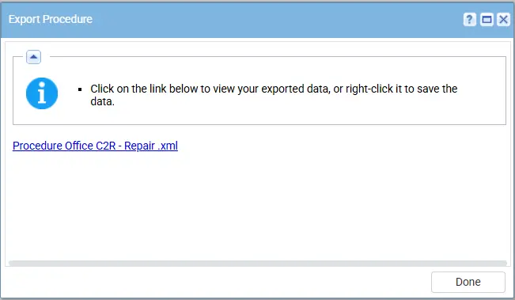
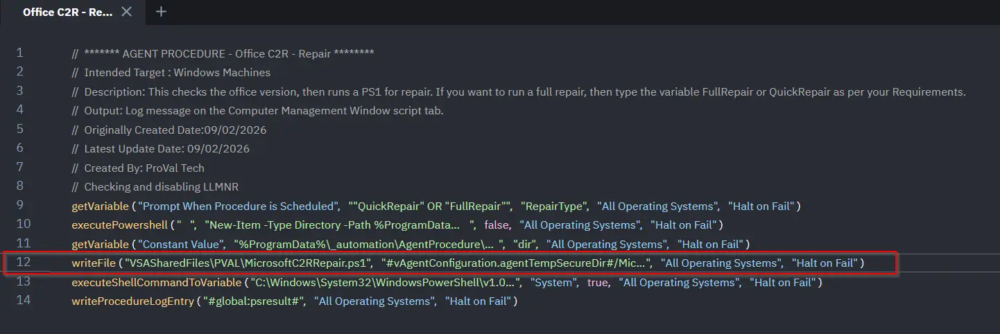

## Summary

This checks the office version, then runs a PS1 for repair. If you want to run a full repair, then type the variable FullRepair or QuickRepair as per your Requirements.

**Accepted Values for the variable:**

* QuickRepair
* FullRepair

## Dependencies

- PowerShell 5.0+
- `MicrosoftC2RRepair.ps1`
- [Solution - Microsoft365 Click-to-Run Solution](/docs/f8deaddc-02c1-492d-b9dc-381a653de0e5) 

## Implementation

1. Export the agent procedure from ProVal's VSA RMM instance.   
   **Name:** `Office C2R - Repair`   
     
   The export will download the necessary XML file.   
   
2. Import this XML file into the partner's VSA RMM instance.   

3. Export the `MicrosoftC2RRepair.ps1` from the ProVal's Internal VSA. This is also placed under the below path:  
`Manage Files` > `Shared Files` > `PVAL` > `MicrosoftC2RRepair.ps1`  

   

4. Map the `MicrosoftC2RRepair.ps1` into the 12th step of the script in the client's environment.

    

5. Execute the agent procedure in the partne's VSA RMM and put the Repair type that you want to do and click Submit:
   

## Output

- Agent Procedure History Log