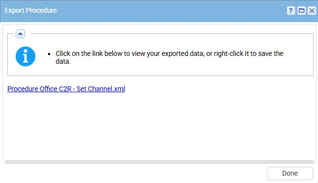
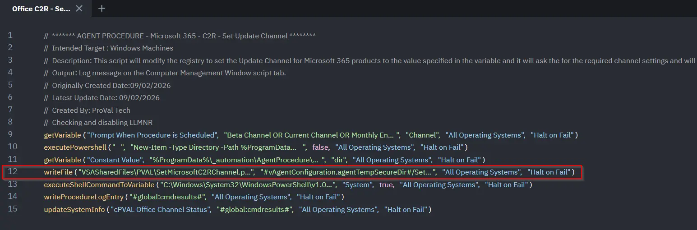

## Summary

This script will modify the registry to set the Update Channel for Microsoft 365 products to the value specified in the runtime variable. It will then update the result into the custom field accordingly.

**Accepted Values for the variable:**

* Beta Channel 
* Current Channel
* Monthly Enterprise Channel
* Semi-Annual Enterprise Channel
* None

## Dependencies

- PowerShell 5.0+
- `SetMicrosoftC2RChannel.ps1`
- [Custom Field - cPVAL Office Channel Status](/docs/880a8d01-fc10-4ea9-94d8-7b2bb87c01a5)
- [Solution - Microsoft365 Click-to-Run Solution](/docs/f8deaddc-02c1-492d-b9dc-381a653de0e5) 

## Implementation

1. Export the agent procedure from ProVal's VSA RMM instance.  
   **Name:** `Office C2R - Set Channel`   
       
   The export will download the necessary XML file.  
  
   
2. Import this XML file into the partner's VSA RMM instance.    
 

3. Export the `SetMicrosoftC2RChannel.ps1` from the ProVal's Internal VSA. This is also placed under the below path:  
`Manage Files` > `Shared Files` > `PVAL` > `SetMicrosoftC2RChannel.ps1`  

     

4. Map the `SetMicrosoftC2RChannel.ps1` into the 12th step of the script in the client's environment.  
      

5. Execute the agent procedure in the partner's VSA RMM and put the channel details that you want to set:  
     

6. After execution, the script validates the device’s channel status and updates the associated custom field accordingly.  

## Output

- Agent procedure log 

 ## Changelog

 ### 2026-03-11

 - Initial version of the document