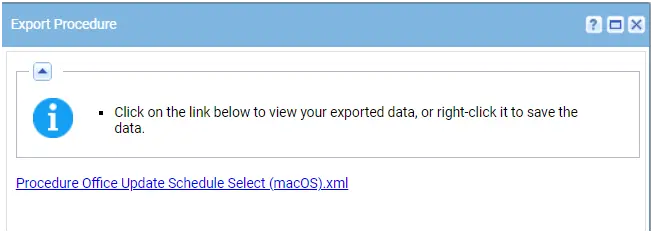
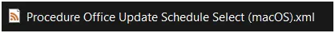
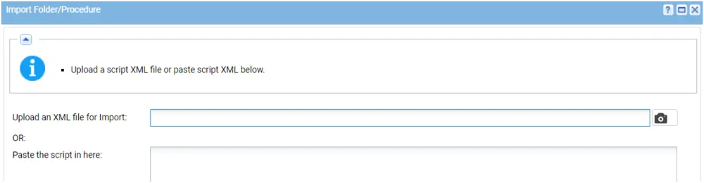

## Summary

This agent procedure is used to set the update channel for Microsoft Office for macOS endpoints.

The following [channels](https://learn.microsoft.com/en-us/microsoft-365-apps/insider/deploy/preference) are available for macOS:

- Current
- Preview
- Beta

## Dependencies

## Implementation

1. Export the agent procedure from ProVal's VSA RMM instance.  
   **Name:** Office Update Schedule Select (macOS)  
     
   The export will download the necessary XML file.  
     
   
2. Import this XML file into the partner's VSA RMM instance.  
     

## Output

The expected Last Exec Status is "success."  
  

### Agent Procedure Log

Two log entries are expected. The procedure will first check the existing channel.  
  

### Custom Field

  