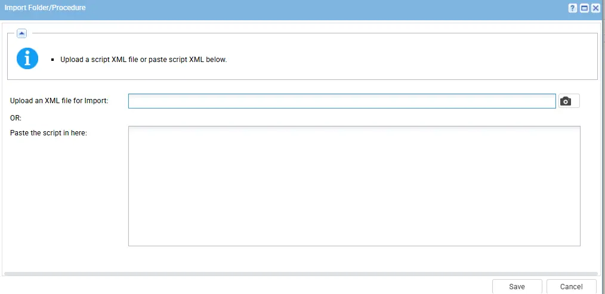
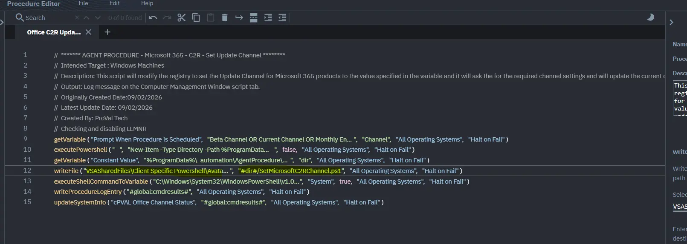
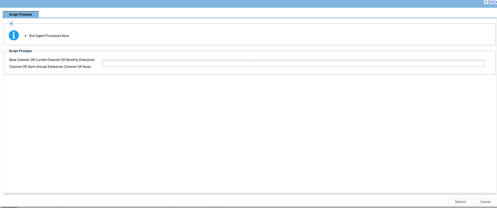

## Summary

This document provides a detailed guide on how to set the Microsoft Update Channel for a Click2Run Office installation on an endpoint using an agent procedure that contains a PS1 and it will ask for the variable at the scritp run time. It includes a summary, example agent procedure logs, and expected output for successful execution.

## Dependencies

PowerShell 5.0+
PS1
Custom field

## Custom field

[cpval office channel status](/docs/880a8d01-fc10-4ea9-94d8-7b2bb87c01a5)

## Process

This script will modify the registry to set the Update Channel for Microsoft 365 products to the value specified in the variable(Beta Channel OR Current Channel OR Monthly Enterprise Channel OR Semi-Annual Enterprise Channel and None) and at the time of script execution on the VSA agent procedure, it will ask for the required channel settings and then it will check the current configured channel and update the result into the Custom field.

## Implementation

1. Export the agent procedure from ProVal's VSA RMM instance.  
   **Name:** Office C2R Update Channel Status 
     
   The export will download the necessary XML file.  
     
   
2. Import this XML file into the partner's VSA RMM instance.  
    

3. Export the PS1 from the Proval Internal VSA
   

4. Mapped it into the script in the client environment
    

5. Execute the agent procedure in the partne's VSA RMM and put the channel details that you want to set:
   

## Output

Agent procedure log 