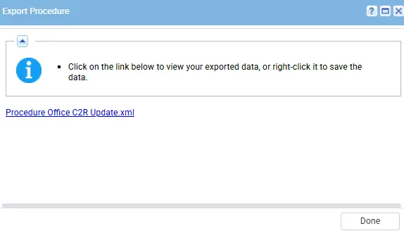
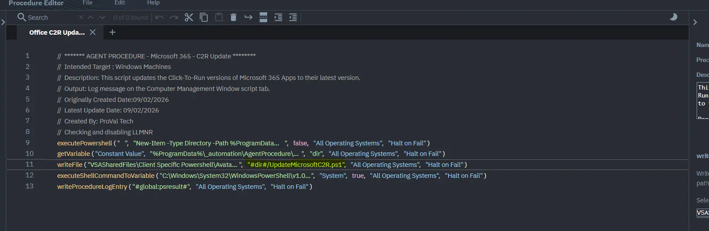

## Summary

This agent procedure is for performing an on-demand update for Click2Run Office installations on endpoints using an agent procedure. It includes example logs, dependencies, and output details to assist in the execution and troubleshooting of the update process.

**Please note it will close all office packages open on the endpoints while performing an update.**

## Dependencies

- PowerShell 5.0+
- [Solution - Microsoft365 Click-to-Run Solution](/docs/f8deaddc-02c1-492d-b9dc-381a653de0e5) 

## Implementation

1. Export the agent procedure from ProVal's VSA RMM instance.  
   **Name:** `Office C2R Update`   
     
   The export will download the necessary XML file.  
     
   
2. Import this XML file into the partner's VSA RMM instance.   
     

3. Export the PS1 from the ProVal Internal VSA   
     

4. Map it into the script in the client's environment  
    

5. Execute the agent procedure in the partner's VSA RMM:  
   

## Output

- Agent Procedure log