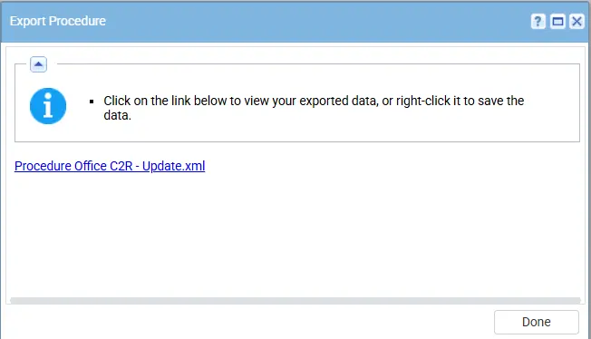
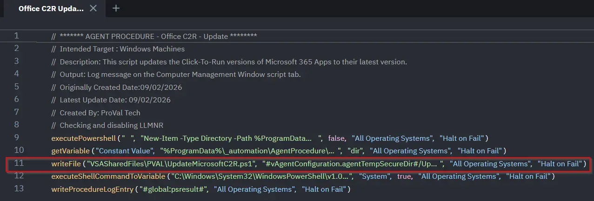
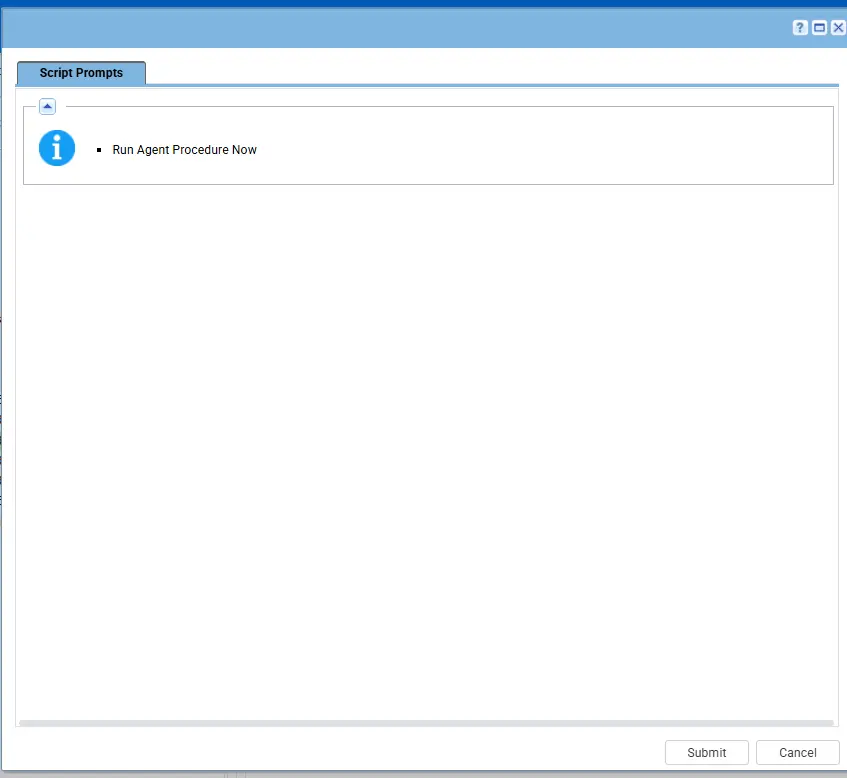

## Summary

This script updates the Click-To-Run version of Microsoft 365 Apps to their latest version. 

**Please note it will close all office packages open on the endpoints while performing an update.**

## Dependencies

- PowerShell 5.0+
- `UpdateMicrosoftC2Rr.ps1`
- [Solution - Microsoft365 Click-to-Run Solution](/docs/f8deaddc-02c1-492d-b9dc-381a653de0e5) 

## Implementation

1. Export the agent procedure from ProVal's VSA RMM instance.  
   **Name:** `Office C2R - Update`   
     
   The export will download the necessary XML file.  
  
   
2. Import this XML file into the partner's VSA RMM instance.    

3. Export the `UpdateMicrosoftC2R.ps1` from the ProVal's Internal VSA. This is also placed under the below path:  
`Manage Files` > `Shared Files` > `PVAL` > `UpdateMicrosoftC2R.ps1`   
     

4. Map the `UpdateMicrosoftC2Rr.ps1` into the 11th step of the script in the client's environment. 
    

5. Execute the agent procedure in the partner's VSA RMM:  
   

## Output

- Agent Procedure log