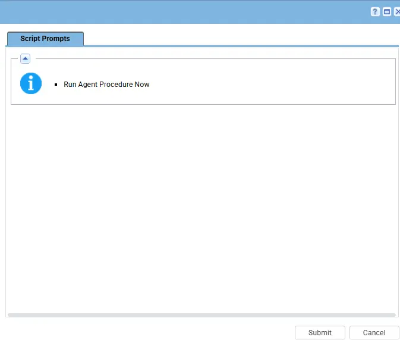
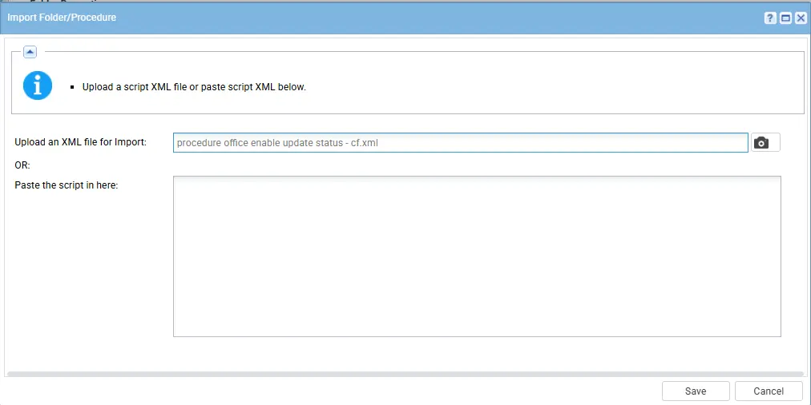
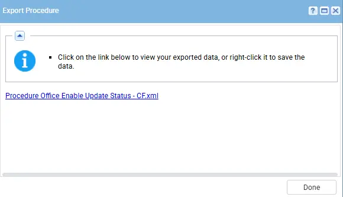

## Summary

This script is used to check the office update status on the machine, wherther its enabled or not and update the result into the Custom field on the machine.

## Dependencies

- PowerShell 5.0+
- [Script - cPVAL Office Update](/docs/1be983dd-ef42-4873-a299-a5cd6e44c2ea)
- [Views - cPVAL Office Updates Enabled](/docs/f71462bc-a274-4bee-839e-0f48effe09c6)
- [Views - cPVAL Office Channel Status](/docs/9c5b8f5a-3e80-499a-bcf2-ac376fedd841)
- [Solution - Microsoft365 Click-to-Run Solution](/docs/1626c96c-80e1-45b9-93f3-d1b8237f911f)

## Implementation

1. 1. Export the agent procedure from ProVal's VSA RMM instance.
   **Name:** `Office Enable Update Status - CF`  
   
   The export will download the necessary XML file.

2. Import this XML file into the partner's VSA RMM instance.

## Execution/Sample Run

Now, You can execute the script on the machine in which you need to check for the office enable status and it will update the result into the custom filed.

## Output

- Agent Procedure log
- Custom Field - cPVAL Office Update

## Changelog

## 2026-04-14

- Initial version of the document