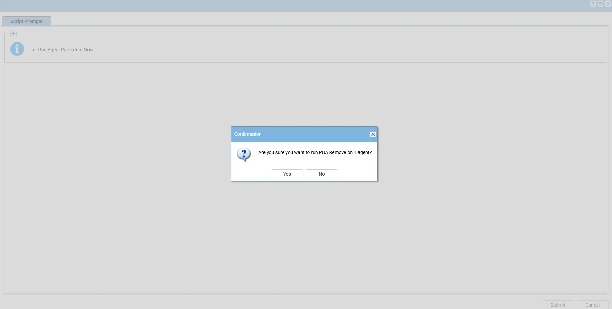
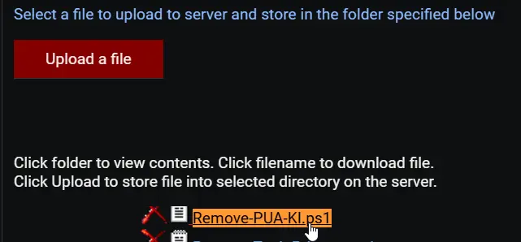

## Summary

This is a VSA implementation of the agnostic script [Remove-PUA](/docs/fda5f79b-3e83-4561-af2b-2533f41c7443). It manages the removal of predefined bloatware packages or lists installed bloatware based on a centrally maintained list. It offers three primary operations: bulk removal, selective removal, PUAListSource  and bloatware listing. The remove parameter allows bypassing the PUA List to remove any installed AppxPackage.

**PUA List:** [PUA List](https://content.provaltech.com/attachments/potentially-unwanted-applications.json)

**EXERCISE EXTREME CAUTION - Removing system components may cause system instability.**

## Sample Run

## Dependencies

- Remove-PUA.ps1
- [Agnostic Script - Remove-PUA](/docs/fda5f79b-3e83-4561-af2b-2533f41c7443)

## Variables

| Variable Name | Description | Syntax |
|-------------- | ----------- | ------ |
| RemoveAll | Remove all bloatware from the machine. Can be used with #exceptions# | 'app1','app2','app3' |
| RemoveSpecific | Remove specific apps per client request. It allows bypassing the PUA List to remove any installed AppxPackage. | 'app1','app2','app3'                |
| category | Remove all apps from a specific category. Multiple categories can be selected. Valid Categories: MsftBloatApps, ThirdPartyBloatApps | 'MsftBloatApps','ThirdPartyBloatApps' |
| exceptions | Set app exceptions for #RemoveAll# and #category# (Apps you want to keep) | 'app1','app2','app3' |
| ListBloatware | List all installed Appx packages |  |
| PUAListSource | Use the below variable to PUAListSource to remove the specific applications present under the JSON file. | |

## Implementation

1. Export the agent procedure from ProVal's VSA RMM instance.   
   **Name:** `PUA Remove` 

   The export will download the necessary XML file.   
   
2. Import this XML file into the partner's VSA RMM instance.   

3. Export the `Remove-PUA-KI.ps1` from the ProVal's Internal VSA. This is also placed under the below path:  
`Manage Files` > `Shared Files` > `PVAL` > `Remove-PUA-KI.ps1`  

   

4. Map the `Remove-PUA-KI.ps1` into the `45th` step of the script in the client's environment.

## Variables

| Variable Name | Description | Syntax |
|-------------- | ----------- | ------ |
| RemoveAll | Remove all bloatware from the machine. Can be used with #exceptions# | `'app1','app2','app3'` |
| RemoveSpecific | Remove specific apps per client request. It allows bypassing the PUA List to remove any installed AppxPackage. | `'app1','app2','app3'`                |
| category | Remove all apps from a specific category. Multiple categories can be selected. Valid Categories: MsftBloatApps, ThirdPartyBloatApps | `'MsftBloatApps','ThirdPartyBloatApps'` |
| exceptions | Set app exceptions for #RemoveAll# and #category# (Apps you want to keep) | `'app1','app2','app3'` |
| ListBloatware | List all installed Appx packages |  |
| PUAListSource | Use the below variable to PUAListSource to remove the specific applications present under the JSON file. | |

## Process

Runs the agnostic script [Remove-PUA](/docs/fda5f79b-3e83-4561-af2b-2533f41c7443) with the defined parameters.

## Output

AP Log

## Changelog

### 2025-04-10

- Initial version of the document

### 2025-04-01

- Fixed the bug where the script contained several outdated and potentially incorrect AppxPackage IDs in the bloatware removal arrays. Some Microsoft apps have changed their package identifiers in newer Windows versions, and some third-party apps may have incorrect publisher IDs.

### 2026-03-09

- Updated script to use the new parameter `PUAListSource`.
