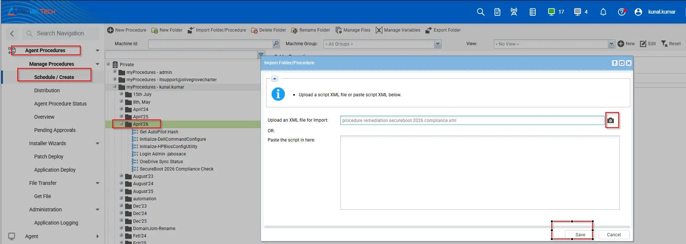
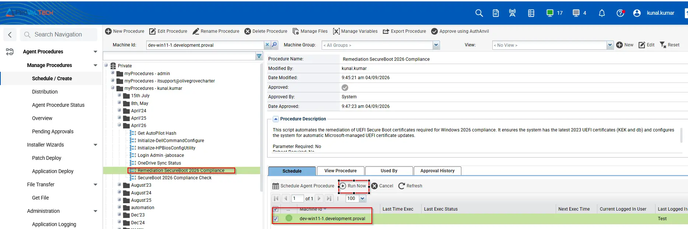
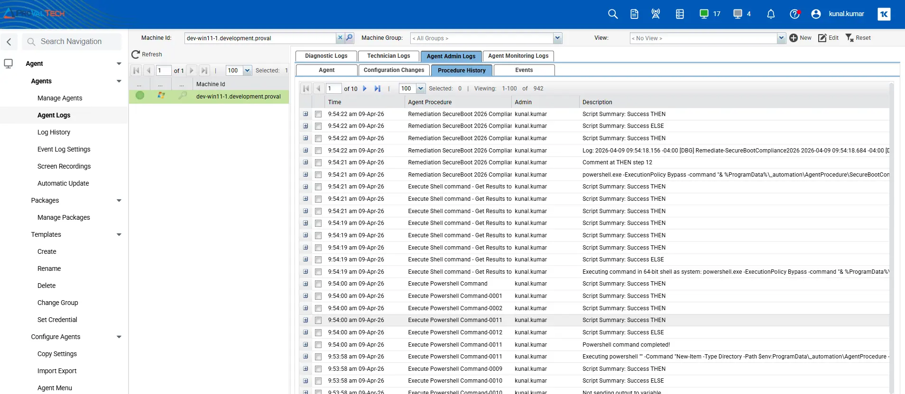

## Summary

This script automates the remediation of UEFI Secure Boot certificates required for Windows 2026 compliance. It ensures the system has the latest 2023 UEFI certificates (KEK and db) and configures the system for automatic Microsoft-managed UEFI certificate updates.

## Mandatory

Once the Agent procedure for `Remediation SecureBoot 2026 Compliance` updates the certificates, the machine must be `rebooted` `twice`. Rebooting the system is `mandatory` for the Secure Boot 2026 certificates to update `successfully`. Without rebooting the machine, the certificates will `not` be applied.

After the system reboots, the check agent procedure [SecureBoot 2026 Compliance Check](/docs/6e3a2154-42ba-471c-8cd5-379e95b3732f) must run again to verify that the `certificates` were updated successfully. The check Agent Procedure will then update the `Custom Field` with the latest results.

## Dependencies

- [Agnostic Script - Remediate-SecureBootCompliance2026](/docs/062c5b72-32b5-4fdb-b48c-5f45a19af42c)

## Implementation  

1. Download the Agent Procedure(XML) `Remediation SecureBoot 2026 Compliance` from the attachments.

2. After downloading the attached file, click on the `Import` button into the VSA under agent procedure module.
 

## Execution Process

To execute the `Agent Procedure` over a specific machine, follow these steps:  

1. Select the machine you want to run the `Remediation SecureBoot 2026 Compliance` agent procedure from the VSA RMM.  

2. Click on the `Execute` button.  
  

 ## Sample Run

| 9:54:22 am 9-Apr-26 | Remediation SecureBoot 2026 Compliance | Success THEN | kunal.kumar |
| 9:54:22 am 9-Apr-26 | Remediation SecureBoot 2026 Compliance-0002 | Success ELSE | kunal.kumar |
| 9:54:22 am 9-Apr-26 | Remediation SecureBoot 2026 Compliance-0001 | Success THEN | kunal.kumar |
| 9:54:22 am 9-Apr-26 | Remediation SecureBoot 2026 Compliance-0001 | Log: 2026-04-09 09:54:18.156 -04:00 [DBG] Remediate-SecureBootCompliance2026 2026-04-09 09:54:18.684 -04:00 [DBG] System: DEV-WIN11-1 2026-04-09 09:54:18.704 -04:00 [DBG] User: SYSTEM 2026-04-09 09:54:18.726 -04:00 [DBG] OS Bitness: 64 2026-04-09 09:54:18.744 -04:00 [DBG] PowerShell Bitness: 64 2026-04-09 09:54:18.788 -04:00 [DBG] PowerShell Version: 5 2026-04-09 09:54:18.809 -04:00 [INF] ===== Secure Boot 2026 Remediation Started ===== 2026-04-09 09:54:18.979 -04:00 [INF] Secure Boot Enabled - Proceeding 2026-04-09 09:54:19.027 -04:00 [INF] Checking current certificate status... 2026-04-09 09:54:19.100 -04:00 [INF] KEK 2023 Present: True 2026-04-09 09:54:19.118 -04:00 [INF] DB 2023 Present: True 2026-04-09 09:54:19.153 -04:00 [INF] System Already Compliant - No action needed 2026-04-09 09:54:19.173 -04:00 [INF] Compliant - Certificates Already Updated 2026-04-09 09:54:19.194 -04:00 [INF] KEK 2023: Present 2026-04-09 09:54:19.213 -04:00 [INF] DB 2023: Present | kunal.kumar |
| 9:54:21 am 9-Apr-26 | Remediation SecureBoot 2026 Compliance | Comment at THEN step 12 | kunal.kumar |
| 9:54:21 am 9-Apr-26 | Remediation SecureBoot 2026 Compliance | powershell.exe -ExecutionPolicy Bypass -command "& %ProgramData%\_automation\AgentProcedure\SecureBootCompliance2026\Remediate-SecureBootCompliance2026.ps1 " | kunal.kumar |
| 9:54:21 am 9-Apr-26 | Execute Shell command - Get Results to Variable | Success THEN | kunal.kumar |
| 9:54:21 am 9-Apr-26 | Execute Shell command - Get Results to Variable-0001 | Success THEN | kunal.kumar |
| 9:54:21 am 9-Apr-26 | Execute Shell command - Get Results to Variable-0010 | Success THEN | kunal.kumar |
| 9:54:19 am 9-Apr-26 | Execute Shell command - Get Results to Variable-0002 | Success THEN | kunal.kumar |
| 9:54:19 am 9-Apr-26 | Execute Shell command - Get Results to Variable-0003 | Success THEN | kunal.kumar |
| 9:54:19 am 9-Apr-26 | Execute Shell command - Get Results to Variable-0004 | Success THEN | kunal.kumar |
| 9:54:19 am 9-Apr-26 | Execute Shell command - Get Results to Variable-0005 | Success ELSE | kunal.kumar |
| 9:54:19 am 9-Apr-26 | Execute Shell command - Get Results to Variable-0005 | Executing command in 64-bit shell as system: powershell.exe -ExecutionPolicy Bypass -command "& %ProgramData%\_automation\AgentProcedure\SecureBootCompliance2026\Remediate-SecureBootCompliance2026.ps1 " >"c:\kworking\commandresults-2018020156.txt" 2>&1 | kunal.kumar |
| 9:54:00 am 9-Apr-26 | Execute Powershell Command | Success THEN | kunal.kumar |
| 9:54:00 am 9-Apr-26 | Execute Powershell Command-0001 | Success THEN | kunal.kumar |
| 9:54:00 am 9-Apr-26 | Execute Powershell Command-0002 | Success THEN | kunal.kumar |
| 9:54:00 am 9-Apr-26 | Execute Powershell Command-0011 | Success THEN | kunal.kumar |
| 9:54:00 am 9-Apr-26 | Execute Powershell Command-0012 | Success ELSE | kunal.kumar |
| 9:54:00 am 9-Apr-26 | Execute Powershell Command-0011 | Powershell command completed! | kunal.kumar |
| 9:53:58 am 9-Apr-26 | Execute Powershell Command-0011 | Executing powershell "" -Command "New-Item -Type Directory -Path $env:ProgramData\_automation\AgentProcedure -name SecureBootCompliance2026" "" | kunal.kumar |
| 9:53:58 am 9-Apr-26 | Execute Powershell Command-0009 | Success THEN | kunal.kumar |
| 9:53:58 am 9-Apr-26 | Execute Powershell Command-0010 | Success ELSE | kunal.kumar |
| 9:53:58 am 9-Apr-26 | Execute Powershell Command-0010 | Not sending output to variable. | kunal.kumar |
| 9:53:57 am 9-Apr-26 | Execute Powershell Command-0007 | Success THEN | kunal.kumar |
| 9:53:57 am 9-Apr-26 | Execute Powershell Command-0008 | Success THEN | kunal.kumar |
| 9:53:57 am 9-Apr-26 | Execute Powershell Command-0008 | New command variable is: -Command "New-Item -Type Directory -Path $env:ProgramData\_automation\AgentProcedure -name SecureBootCompliance2026" | kunal.kumar |
| 9:53:57 am 9-Apr-26 | Execute Powershell Command-0008 | Custom commands detected as New-Item -Type Directory -Path $env:ProgramData\_automation\AgentProcedure -name SecureBootCompliance2026 | kunal.kumar |
| 9:53:57 am 9-Apr-26 | Execute Powershell Command-0003 | Success THEN | kunal.kumar |
| 9:53:57 am 9-Apr-26 | Execute Powershell Command-0004 | Success ELSE | kunal.kumar |
| 9:53:56 am 9-Apr-26 | Execute Powershell Command-0002 | Powershell is present. | kunal.kumar |
| 9:53:55 am 9-Apr-26 | Remediation SecureBoot 2026 Compliance | Remediate-SecureBootCompliance2026.ps1 | kunal.kumar |
| 9:53:47 am 9-Apr-26 | Run Now - Remediation SecureBoot 2026 Compliance | Admin kunal.kumar scheduled procedure Run Now - Remediation SecureBoot 2026 Compliance to run at Apr 9 2026 9:53AM | kunal.kumar |

## Output

- Agent Procedure History Log

## Changelog

### 2026-04-09

- Initial version of the document