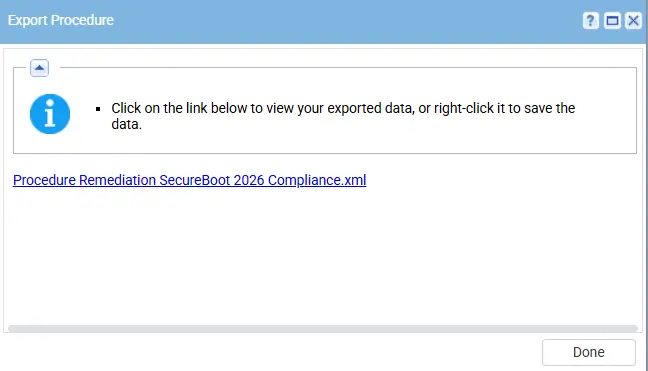
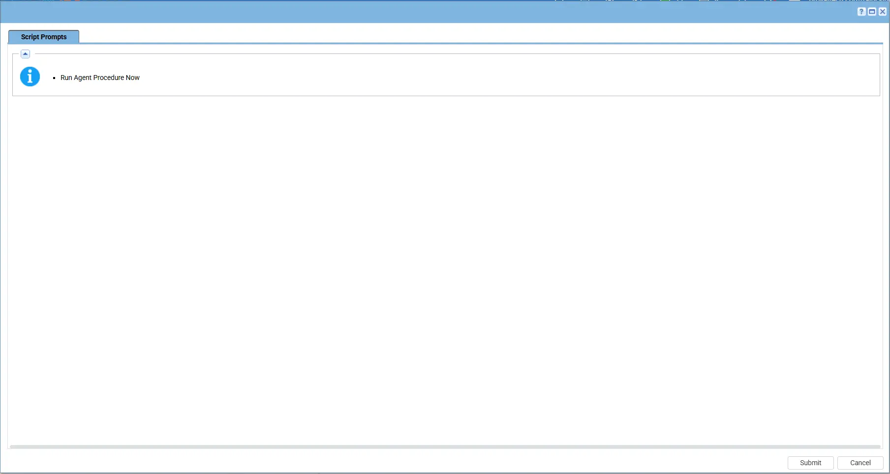

## Summary

This script automates the remediation of UEFI Secure Boot certificates required for Windows 2026 compliance. It ensures the system has the latest 2023 UEFI certificates (KEK and db) and configures the system for automatic Microsoft-managed UEFI certificate updates.

## Mandatory

Once the Agent procedure for `Remediation SecureBoot 2026 Compliance` updates the certificates, the machine must be `rebooted` `twice`. Rebooting the system is `mandatory` for the Secure Boot 2026 certificates to update `successfully`. Without rebooting the machine, the certificates will `not` be applied.

After the system reboots, the check agent procedure [SecureBoot 2026 Compliance Check](/docs/6e3a2154-42ba-471c-8cd5-379e95b3732f) must run again to verify that the `certificates` were updated successfully. Run the [SecureBoot 2026 Compliance Check](/docs/6e3a2154-42ba-471c-8cd5-379e95b3732f) script after reboot to check the compliance status.
## Dependencies

- PowerShell 5.0+
- [Agnostic Script - Remediate-SecureBootCompliance2026](/docs/062c5b72-32b5-4fdb-b48c-5f45a19af42c)
- [Solution - Secureboot Remediation and Audit Solution](/docs/cf6ea3e7-854f-4046-bfdd-6f284feb20f8)

## Implementation  

1. Export the agent procedure from ProVal's VSA RMM instance.  
Name: `Remediation SecureBoot 2026 Compliance`  

2. `Import` this XML file into the partner's VSA RMM instance.

## Execution Process

To Execute the agent procedure in the partner's VSA RMM, follow these steps:  

1. Select the machine you want to run the `Remediation SecureBoot 2026 Compliance` agent procedure from the VSA RMM.  

2. Click on the `Execute` button and click Submit:   

## Output

- Agent Procedure Log

## Changelog

### 2026-04-13

- Initial version of the document