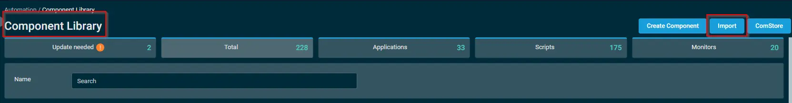
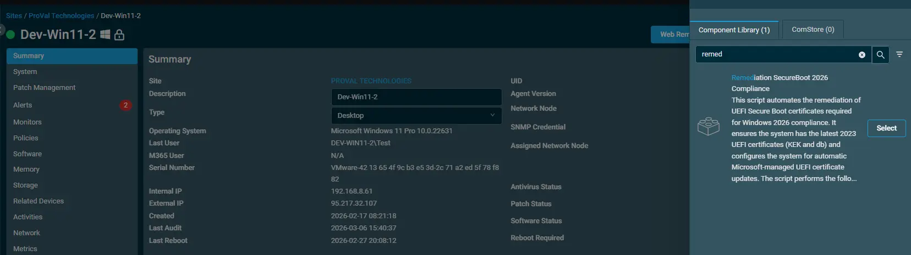
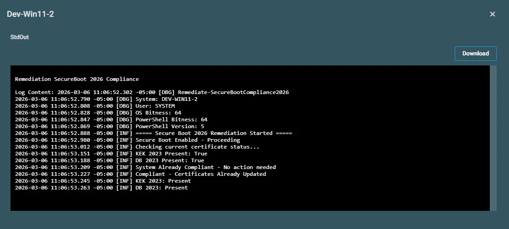

## Summary

This script automates the remediation of UEFI Secure Boot certificates required for Windows 2026 compliance. It ensures the system has the latest 2023 UEFI certificates (KEK and db) and configures the system for automatic Microsoft-managed UEFI certificate updates.

## Mandatory

Once the Agent procedure for `Remediation SecureBoot 2026 Compliance` updates the certificates, the machine must be `rebooted` `twice`. Rebooting the system is `mandatory` for the Secure Boot 2026 certificates to update `successfully`. Without rebooting the machine, the certificates will `not` be applied.

After the system reboots, the check component [SecureBoot 2026 Compliance Check](/docs/48d5dd1c-37ef-4e43-87b8-b10fa565fef4) must run again to verify that the `certificates` were updated successfully. The check Agent Procedure will then update the `Custom Field` with the latest results.

## Dependencies

- [Agnostic Script - Remediate-SecureBootCompliance2026](/docs/062c5b72-32b5-4fdb-b48c-5f45a19af42c)

## Implementation  

1. Download the Agent Procedure(XML) `Remediation SecureBoot 2026 Compliance` from the attachments.

2. After downloading the attached file, click on the `Import` button into the VSA under agent procedure module.

3. Select the Agent procedure just downloaded and add it to the VSA RMM interface.  
  

## Sample Run

To execute the `Agent Procedure` over a specific machine, follow these steps:  

1. Select the machine you want to run the `Remediation SecureBoot 2026 Compliance` agent procedure from the VSA RMM.  

2. Click on the `Execute` button.  
  

3. Search the Agent Procedure `Remediation SecureBoot 2026 Compliance` and click on `Select`
 

## Output

- Agent Procedure History Log

## Changelog

### 2026-04-08

- Initial version of the document