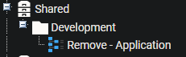

## Summary

This document explains how to remove an application or a list of comma-separated applications using either normal or forceful methods.

## Implementation

This agent procedure is designed as a template and is meant to be exported.  
**Name:** Remove - Application  
  
The agent procedure can be customized to fit the needs of various uninstalls. There are four variables within this agent procedure. See the usage for these below.  

