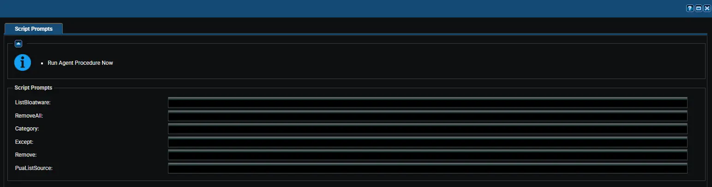

## Summary

This is a VSA implementation of the agnostic script [Remove-PUA](/docs/fda5f79b-3e83-4561-af2b-2533f41c7443). It removes predefined bloatware packages or lists installed bloatware on Windows machines based on a centrally maintained PUA list. It supports three mutually exclusive operations: bulk removal (`RemoveAll`), selective removal (`Remove`), and bloatware listing (`ListBloatware`). The `Remove` parameter bypasses the PUA list entirely and can be used to remove any installed `AppxPackage`, while the optional `PuaListSource` parameter overrides the default curated list with a custom URL or local JSON file.

At runtime, the procedure collects every prompt as a plain string, writes them to a `Remove-PUA-Param.json` file on the endpoint, and launches the implementation wrapper, which validates the configuration, downloads and signature-checks the agnostic script, and executes it with the mapped parameters.

**PUA List:** [PUA List](https://content.provaltech.com/attachments/potentially-unwanted-applications.json)

:::caution  
**EXERCISE EXTREME CAUTION** - *Removing system components may cause system instability.*
:::

**Default Behavior**: Exactly one operation mode must be enabled at runtime: `ListBloatware`, `RemoveAll`, or a populated `Remove` list. If no mode is enabled, or if more than one mode is enabled at the same time, the procedure stops with a `Failure:` result and no changes are made. `Category` and `Except` are only applied in `RemoveAll` mode, and an empty `PuaListSource` falls back to the default curated PUA list. The procedure must run with agent administrator rights.

## Sample Run

## Dependencies

- [PowerShell: Remove-PUA](/docs/fda5f79b-3e83-4561-af2b-2533f41c7443)

## Variables

| Variable | Type | Default | Description | Syntax |
| -------- | ---- | ------- | ----------- | ------ |
| `ListBloatware` | String | `''` | Enables List mode: lists all installed bloatware `AppxPackage` and provisioned packages without removing anything. Enter `True`, `Yes`, or `1` (any case) to enable; any other value, including empty, disables it. Only one mode may be enabled per run. | `True` / `False` |
| `RemoveAll` | String | `''` | Enables RemoveAll mode: removes all bloatware packages from the selected categories (both categories by default). Use `Category` to narrow the scope and `Except` to preserve specific packages. Enter `True`, `Yes`, or `1` (any case) to enable. Only one mode may be enabled per run. | `True` / `False` |
| `Category` | String | `''` | Filters RemoveAll mode to a single curated list: `MsftBloatApps`, `ThirdPartyBloatApps`, or `Both`. Empty or `Both` targets both categories. Only applied when `RemoveAll` is enabled; ignored with a warning in other modes. | `MsftBloatApps` / `ThirdPartyBloatApps` / `Both` |
| `Except` | String | `''` | Comma-separated `AppxPackage` names to exclude from removal. Only applied when `RemoveAll` is enabled; ignored with a warning in other modes. Entries are trimmed and stray quote characters are stripped automatically. | `Microsoft.SolitaireCollection, Microsoft.BingWeather` |
| `Remove` | String | `''` | Comma-separated `AppxPackage` names to remove directly, bypassing the PUA list. A non-empty value enables Remove mode. Only one mode may be enabled per run. | `Microsoft.BingWeather, Microsoft.GetHelp` |
| `PuaListSource` | String | `''` | Alternate PUA list source: an `http`/`https` URL or the full path of an existing local JSON file. Empty uses the default curated PUA list. Values that are neither a valid URL nor an existing local file abort the run before execution. Applies to all modes. | `https://server/pua.json` or `C:\path\to\pua.json` |

Boolean-style prompts (`ListBloatware` and `RemoveAll`) accept `1`, `Yes`, or `True` in any case; any other value, including empty and `False`, is treated as disabled. Comma-separated values are converted to string arrays automatically before being passed to the agnostic script.

## Variable Compatibility

The wrapper deliberately applies **no precedence** between the operation modes. When conflicting variables are set, the run aborts with a `Failure:` result instead of silently choosing one mode over another. All validation happens on the endpoint before the agnostic script is downloaded or any package is touched, and every failure message ends with `No changes were made`. When several problems exist at once, they are combined into a single failure message.

### Mode Variables

`ListBloatware`, `RemoveAll`, and `Remove` select the operation mode and are mutually exclusive — exactly one must be active. `Enabled` means the prompt contains `True`, `Yes`, or `1` (any case); anything else, including empty, counts as `Disabled`. `Populated` means the `Remove` prompt contains at least one package name — an empty `Remove` is not a mode request and is safe to leave blank.

| `ListBloatware` | `RemoveAll` | `Remove` | Result |
| --------------- | ----------- | -------- | ------ |
| Enabled | Disabled | Empty | **Valid** - List mode. Nothing is removed. |
| Disabled | Enabled | Empty | **Valid** - RemoveAll mode. |
| Disabled | Disabled | Populated | **Valid** - Remove mode. |
| Disabled | Disabled | Empty | **Fails** - No operation mode was specified. |
| Enabled | Enabled | Empty | **Fails** - Conflicting modes: List, RemoveAll. |
| Enabled | Disabled | Populated | **Fails** - Conflicting modes: List, Remove. |
| Disabled | Enabled | Populated | **Fails** - Conflicting modes: RemoveAll, Remove. |
| Enabled | Enabled | Populated | **Fails** - Conflicting modes: List, RemoveAll, Remove. |

### Mode-Specific Variables

| Variable | List Mode | RemoveAll Mode | Remove Mode |
| -------- | --------- | -------------- | ----------- |
| `Category` | Ignored, warning logged | Applied | Ignored, warning logged |
| `Except` | Ignored, warning logged | Applied | Ignored, warning logged |
| `PuaListSource` | Applied | Applied | Accepted, but unused for selection |

Being ignored is not a failure — the run proceeds normally and the unused setting is reported as a warning in the agent log. A specific category value triggers the warning; empty or `Both` does not. `PuaListSource` is safe to combine with `Remove`, but note that the agnostic script still loads the custom list in every mode, so an unreachable source or invalid JSON aborts the run even in Remove mode where the list does not drive the selection.

### Rules That Fail the Run in Any Mode

- No mode enabled — all mode prompts disabled or empty.
- `Category` set to anything other than `MsftBloatApps`, `ThirdPartyBloatApps`, or `Both` (case-insensitive). This is validated even in List and Remove modes, where the setting is otherwise unused.
- `PuaListSource` set to a value that is neither an `http`/`https` URL nor the path of an existing local JSON file. The wrapper validates the form only — a well-formed URL that is unreachable or returns invalid JSON aborts later inside the agnostic script, before anything is listed or removed.

### Safe Input Conditions

None of the following break the run:

- Boolean prompts treat anything other than `1`/`Yes`/`True` as disabled — `False`, `No`, `0`, and empty are all safe. A typo such as `Ture` silently disables the mode, which can then trigger the no-mode failure if no other mode is set.
- `Category` empty or `Both` in RemoveAll mode removes from both categories.
- Spaces around commas and stray quote characters in `Except`/`Remove` are trimmed and stripped automatically.
- `PuaListSource` empty uses the default curated PUA list.

### Valid Combination Examples

| Goal | Variables to Set |
| ---- | ---------------- |
| List installed bloatware | `ListBloatware=True` |
| List against a custom PUA list | `ListBloatware=True`, `PuaListSource=<URL or path>` |
| Remove all bloatware | `RemoveAll=True` |
| Remove only Microsoft bloatware | `RemoveAll=True`, `Category=MsftBloatApps` |
| Remove all Microsoft bloatware except Solitaire | `RemoveAll=True`, `Category=MsftBloatApps`, `Except=Microsoft.SolitaireCollection` |
| Remove only specific packages | `Remove=Microsoft.BingWeather,Microsoft.GetHelp` |
| Remove specific packages with a custom list present | `Remove=<packages>`, `PuaListSource=<URL or path>` |

## Implementation

1. Export the agent procedure from ProVal's VSA RMM instance.
   **Name:** `Remove PUA`

   The export will download the necessary XML file.

2. Import this XML file into the partner's VSA RMM instance.

3. Export the `Remove-PUA-KI.ps1` from the ProVal's Internal VSA. This is also placed under the below path:
   `Manage Files` > `Shared Files` > `PVAL` > `Remove-PUA-KI.ps1`  
   

4. Map the `Remove-PUA-KI.ps1` into the `45th` step of the script in the client's environment.

## Output

- Agent Procedure Log - status lines and the final `Success:` / `Failure:` result
- `Remove-PUA-log.txt` - per-package results written by the agnostic script
- `Remove-PUA-error.txt` - errors written by the agnostic script

## Changelog

### 2026-09-11

- Procedure renamed from `PUA Remove` to `Remove PUA`.
- Runtime parameters are now written to a JSON parameter file (`Remove-PUA-Param.json`) and consumed by the new implementation wrapper; all prompts are plain strings that the wrapper normalizes.
- Variable names aligned with the agnostic script parameters: `RemoveSpecific` is now `Remove`, `Exceptions` is now `Except`, and `PUAListSource` is now `PuaListSource`.
- Strict single-mode validation: exactly one of `ListBloatware`, `RemoveAll`, or a populated `Remove` list must be enabled; the procedure now fails fast instead of defaulting to a listing when nothing is set.
- `Category` now accepts a single value (`MsftBloatApps`, `ThirdPartyBloatApps`, or `Both`) instead of a list of categories.
- `PuaListSource` values are validated (valid URL or existing local JSON file) before the agnostic script is executed.

### 2026-09-04

- Updated script to use the new parameter `PUAListSource` and `ListBloatware`.
- Updated VSA script to use the new template.

### 2025-04-10

- Fixed the bug where the script contained several outdated and potentially incorrect AppxPackage IDs in the bloatware removal arrays. Some Microsoft apps have changed their package identifiers in newer Windows versions, and some third-party apps may have incorrect publisher IDs.

### 2025-04-01

- Initial version of the document
