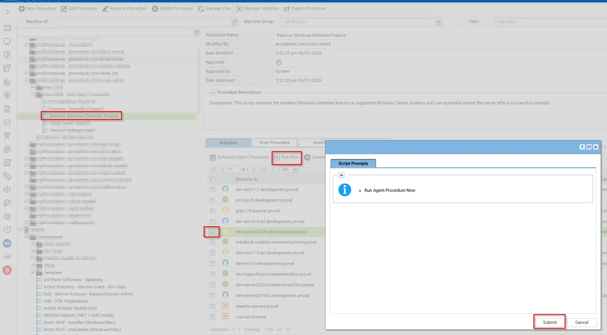

## Description
This script removes the installed Windows Defender feature on supported Windows Server systems and can optionally restart the server after a successful uninstall.

## Sample Run

 

## Dependencies

- PowerShell 5.0+
- Remove-WindowsDefenderFeature.ps1
- [Agnostic Script](/docs/4fcf3a89-30a1-4c63-99a1-d4d8a706f95b)

## Implementation

1. Export the agent procedure from ProVal's VSA RMM instance.   
   **Name:** Remove Windows Defender Feature   

   The export will download the necessary XML file.   
   
2. Import this XML file into the partner's VSA RMM instance.

3. In line number 12, The default for this is 0, which will not force reboot. If the machine needs to be rebooted then, this can be changed to 1.   

## Output

Script Logs

## Changelog

### 2026-06-01

- Initial version of the script.
