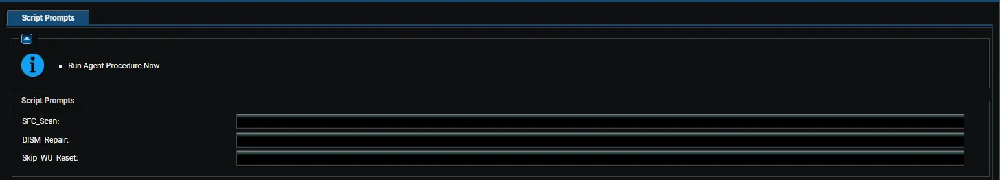

## Overview

This automated procedure repairs corrupted Windows Update components, resolves common update errors, and optionally runs deep system health checks (DISM and SFC). Regular maintenance of the Windows Update agent ensures that security patches and feature updates install reliably without getting stuck or failing.

To minimize manual intervention, this procedure securely downloads and executes a pre-approved repair script, automatically handling service restarts, cache clearing, and system file validation based on your selected configuration.

## How It Works

1. **Configuration Generation:** When the procedure runs, it checks which repair options were selected by your IT administrator (such as running SFC, DISM, or skipping the update reset). It safely writes these settings into a temporary configuration file (JSON format) on the local machine.

2. **Secure Download & Validation:** The procedure launches a wrapper script that securely downloads the agnostic repair payload from the content repository. It strictly validates the digital signature of the downloaded script against trusted ProVal thumbprints before execution.

3. **Smart Execution:** The wrapper reads the configuration file. If specific settings were provided, it passes them as switches to the agnostic script. If the file is missing or blank, the script automatically falls back to its default behavior (resetting Windows Update components without running SFC/DISM).

4. **Component Repair & Reset:** The agnostic script takes over. It safely stops services, clears out old backup folders to prevent disk bloat, runs DISM and SFC in the correct order (if requested), resets the Windows Update agent, and pulls a fresh update inventory.

## Key Benefits & Behaviors

* **Optimized Repair Order:** When both DISM and SFC are selected, the script automatically runs DISM first to repair the underlying Windows image, ensuring SFC has a healthy source to pull from when fixing system files.
* **Disk Space Management:** Automatically detects and removes old, leftover Windows Update backup folders (like `SoftwareDistribution.bak` and `Catroot2.bak`) that accumulate over time and consume valuable disk space.
* **Secure & Verified:** All downloads are forced over TLS 1.2/1.3, and execution is blocked if the script signature is invalid, missing, or untrusted.
* **Fallback Safe:** If the JSON configuration file is accidentally deleted or left blank by the RMM agent, the script will not fail; it will simply execute the standard Windows Update reset.

## Dependencies

- [Repair-WindowsUpdate](/docs/39345bfd-d9e2-4e68-9d7a-3e8b443140cc)

## Implementation

1. Export the agent procedure from ProVal's VSA RMM instance.  
   **Name:** `Repair Windows Update [Reset & Repair]`  

   The export will download the necessary XML file.  
2. Import this XML file into the partner's VSA RMM instance.  
3. Export the `Repair-WindowsUpdate-KI.ps1` from ProVal's Internal VSA. This is also placed under the below path:  
`Manage Files` > `Shared Files` > `PVAL` > `Repair-WindowsUpdate-KI.ps1`  
4. Map the `Repair-WindowsUpdate-KI.ps1` into the `37th` script step in the client's environment.

## Sample Run

### Configuring the Variables

**Repair Options:**

1. Set `DismRepair` to `True` to repair the Windows component store before checking system files.
2. Set `SfcScan` to `True` to scan and repair corrupted Windows system files.
3. Set `SkipWUReset` to `True` if you only want to run system health checks (DISM/SFC) without resetting the Windows Update services and caches.

## Variables

| Variable | Type | Default | Description |
|----------|------|---------|-------------|
| `DismRepair` | String | `False` | Enable to run the DISM RestoreHealth command. This repairs the underlying Windows image and should be run before SFC. `Accepted values: 1, Yes, True` |
| `SfcScan` | String | `False` | Enable to run the System File Checker (`sfc /scannow`). This scans and repairs corrupted Windows system files. `Accepted values: 1, Yes, True` |
| `SkipWUReset` | String | `False` | Enable to skip the Windows Update component reset and inventory pull. Use this if you only want to perform system health checks without touching update services. `Accepted values: 1, Yes, True` |

## Real-Life Scenarios

### Scenario 1: Standard Update Reset (Default)

**Settings:** All variables left at default (`False`).

**What happens:**

- The script skips DISM and SFC to save time.
- It stops Windows Update services, deletes old `.bak` cache folders, and renames the active `SoftwareDistribution` and `Catroot2` folders.
- It restarts the services and pulls a fresh inventory of available updates.
- **Best for:** Machines where updates are stuck at "Checking for updates" or failing to download.

### Scenario 2: Comprehensive System & Update Repair

**Settings:**

- `DismRepair` = `True`
- `SfcScan` = `True`

**What happens:**

- The script first runs DISM to ensure the Windows component store is healthy.
- It then runs SFC to repair any corrupted system files using the healthy component store.
- Finally, it performs the full Windows Update reset and pulls a new inventory.
- **Best for:** Machines experiencing repeated update installation failures (e.g., error 0x800f081f) or general OS instability.

### Scenario 3: System Health Check Only

**Settings:**

- `DismRepair` = `True`
- `SfcScan` = `True`
- `SkipWUReset` = `True`

**What happens:**

- The script runs DISM and SFC to repair the OS image and system files.
- It completely skips the Windows Update service resets and cache clearing.
- **Best for:** Post-patching validation or troubleshooting general Windows errors without disrupting the current Windows Update agent state.

### Scenario 4: Missing Configuration File

**Settings:** The RMM agent fails to write the JSON configuration file due to a permissions glitch or agent error.

**What happens:**

- The wrapper script detects that the JSON file is missing or blank.
- Instead of failing, it gracefully falls back to the default behavior and executes the standard Windows Update reset (Scenario 1).
- **Best for:** Ensuring the procedure never fails silently and always attempts a baseline repair.

## Output

- Script execution log (managed via the Strapper module)
- Standard Windows Update logs (`C:\Windows\Logs\CBS\CBS.log` and `C:\Windows\Logs\DISM\dism.log`) if DISM/SFC are executed.

## Changelog

### 2026-08-18

- Initial version of the document.
