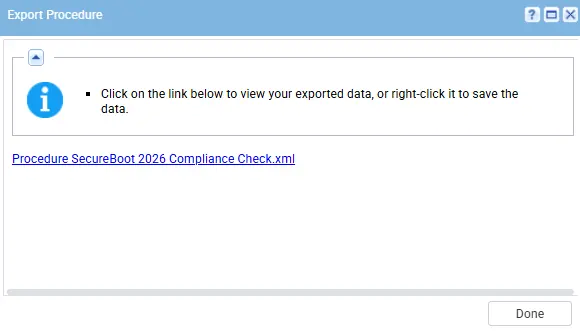
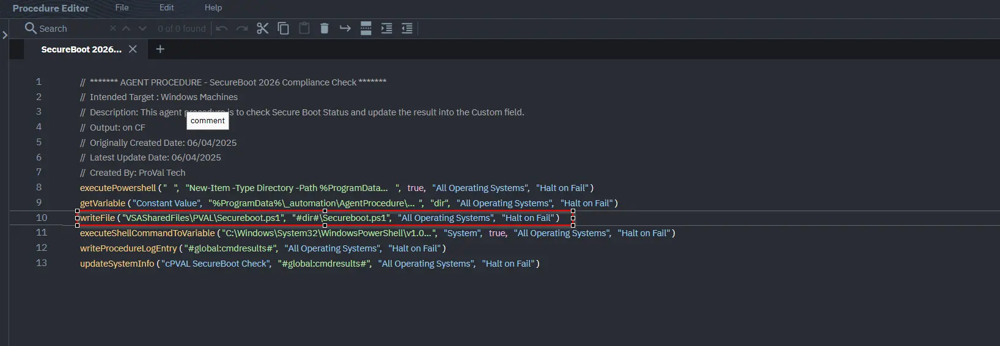
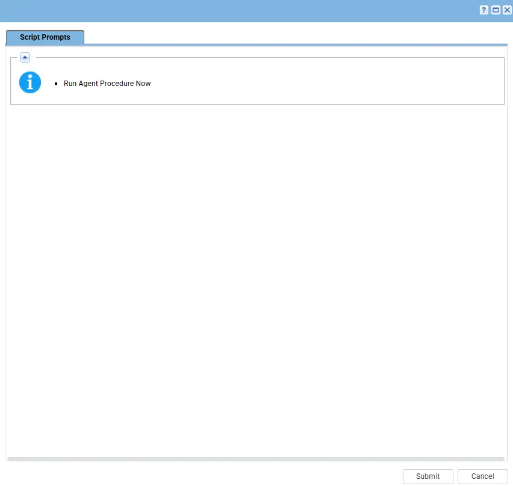
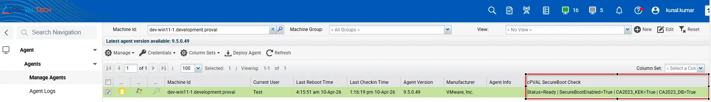

## Summary

This script evaluates whether a Windows device is prepared for the upcoming Microsoft Secure Boot certificate transition scheduled for 2026 and updates the [cPVAL SecureBoot Check](/docs/a79ce245-02ad-425d-81cb-d2fbfdc88820) custom field with the compliane status. Microsoft is replacing legacy Secure Boot certificates with updated 2023-era certificates (KEK and DB). Devices that do not contain these updated certificates may be considered at risk once older certificates expire.

The script performs the following checks:

- Verifies that Secure Boot is enabled.
- Checks for presence of:
  - Microsoft Corporation KEK 2K CA 2023
  - Windows UEFI CA 2023 (DB certificate)
- Determines overall readiness status:
  - Ready  → Secure Boot enabled + both 2023 certificates present
  - Risk   → Secure Boot enabled but 2023 certificates missing
  - N/A    → Secure Boot disabled or not supported

## Dependencies

- PowerShell 5.0+
- Secureboot.ps1
- [cPVAL SecureBoot Check](/docs/a79ce245-02ad-425d-81cb-d2fbfdc88820)
- [Solution - Secureboot Remediation and Audit Solution](/docs/cf6ea3e7-854f-4046-bfdd-6f284feb20f8)

## Implementation

1. Export the agent procedure from ProVal's VSA RMM instance.  
Name: `SecureBoot 2026 Compliance Check`    
   
The export will download the necessary XML file.

2. Import this XML file into the partner's VSA RMM instance.  

3. Export the Secureboot.ps1 from the ProVal's Internal VSA. This is also placed under the below path:  
`Manage Files` > `Shared Files` > `PVAL` > `Secureboot.ps1`  

4. Map the `Secureboot.ps1` into the 10th step of the script in the client's environment.

5. To `Execute`, select the agent procedure and click on run now and then submit.

## Output

- Agent Procedure Log
- Custom Field

## Changelog

### 2026-04-13

- Initial version of the document