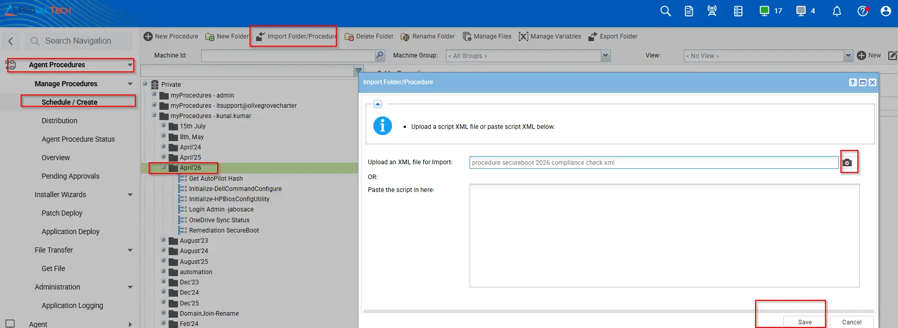
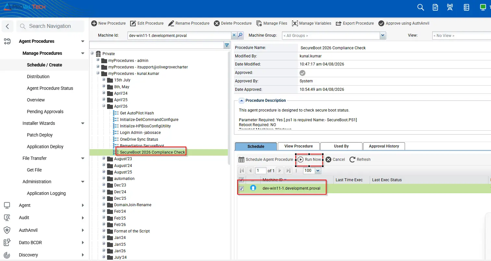

## Summary

This script evaluates whether a Windows device is prepared for the upcoming Microsoft Secure Boot certificate transition scheduled for 2026. Microsoft is replacing legacy Secure Boot certificates with updated 2023-era certificates (KEK and DB). Devices that do not contain these updated certificates may be considered at risk once older certificates expire.

The script performs the following checks:

- Verifies that Secure Boot is enabled.
- Checks for presence of:
  - Microsoft Corporation KEK 2K CA 2023
  - Windows UEFI CA 2023 (DB certificate)
- Determines overall readiness status:
  - Ready  → Secure Boot enabled + both 2023 certificates present
  - Risk   → Secure Boot enabled but 2023 certificates missing
  - N/A    → Secure Boot disabled or not supported
- Outputs a compact compliance string.
- Optionally writes the result to a VSA RMM Custom field.

## Implementation

1. Download the Agent procedure `SecureBoot 2026 Compliance Check` from the attachments with PS1.

2. After downloading the attached files, click on the `Import` button into the VSA under the agent procedure module and Import the PS1 under the manage file, as well.
3. Select the Agent procedure just downloaded and `Import` it to the VSA RMM interface.  
 
4. To `Execute`Select the agent procedure and click on run now.
 

## Sample Run

| Time                     | Action                           | Result                                                                                                        | User                             |
|--------------------------|----------------------------------|---------------------------------------------------------------------------------------------------------------|----------------------------------|

| 10:56:11 am 8-Apr-26 | SecureBoot 2026 Compliance Check | Success THEN | kunal.kumar |
| 10:56:11 am 8-Apr-26 | SecureBoot 2026 Compliance Check | Status=Ready | SecureBootEnabled=True | CA2023_KEK=True | CA2023_DB=True | kunal.kumar |
| 10:56:11 am 8-Apr-26 | Execute Shell command - Get Results to Variable | Success THEN | kunal.kumar |
| 10:56:11 am 8-Apr-26 | Execute Shell command - Get Results to Variable-0001 | Success THEN | kunal.kumar |
| 10:56:11 am 8-Apr-26 | Execute Shell command - Get Results to Variable-0010 | Success THEN | kunal.kumar |
| 10:56:09 am 8-Apr-26 | Execute Shell command - Get Results to Variable-0002 | Success THEN | kunal.kumar |
| 10:56:09 am 8-Apr-26 | Execute Shell command - Get Results to Variable-0003 | Success THEN | kunal.kumar |
| 10:56:09 am 8-Apr-26 | Execute Shell command - Get Results to Variable-0004 | Success THEN | kunal.kumar |
| 10:56:09 am 8-Apr-26 | Execute Shell command - Get Results to Variable-0005 | Success ELSE | kunal.kumar |
| 10:56:09 am 8-Apr-26 | Execute Shell command - Get Results to Variable-0005 | Executing command in 64-bit shell as system: C:\Windows\System32\WindowsPowerShell\v1.0\powershell.exe -ExecutionPolicy Bypass -Command %ProgramData%\_automation\AgentProcedure\SecureBoot\Secureboot.ps1 >"c:\kworking\commandresults-1274069634.txt" 2>&1 | kunal.kumar |
| 10:56:07 am 8-Apr-26 | Execute Powershell Command | Success THEN | kunal.kumar |
| 10:56:07 am 8-Apr-26 | Execute Powershell Command-0001 | Success THEN | kunal.kumar |
| 10:56:07 am 8-Apr-26 | Execute Powershell Command-0002 | Success THEN | kunal.kumar |
| 10:56:07 am 8-Apr-26 | Execute Powershell Command-0011 | Success THEN | kunal.kumar |
| 10:56:07 am 8-Apr-26 | Execute Powershell Command-0012 | Success THEN | kunal.kumar |
| 10:56:07 am 8-Apr-26 | Execute Powershell Command-0012 | Results returned to global variable #global:psresult# and saved in Documents tab of server. | kunal.kumar |
| 10:56:07 am 8-Apr-26 | Execute Powershell Command-0012 | Informational: GetFile command overwrote the server file C:\Kaseya\UserProfiles\385190429391064\GetFiles\..\docs\psoutput.txt with the new contents from c:\kworking\psoutput.txt in THEN step 2. | kunal.kumar |
| 10:56:07 am 8-Apr-26 | Execute Powershell Command-0011 | Powershell command completed! | kunal.kumar |
| 10:56:05 am 8-Apr-26 | Execute Powershell Command-0011 | Executing powershell "" -Command "New-Item -Type Directory -Path %ProgramData%\_automation\AgentProcedure -Name SecureBoot -ErrorAction SilentlyContinue" >"c:\kworking\psoutput.txt" | kunal.kumar |
| 10:56:05 am 8-Apr-26 | Execute Powershell Command-0009 | Success THEN | kunal.kumar |
| 10:56:05 am 8-Apr-26 | Execute Powershell Command-0010 | Success THEN | kunal.kumar |
| 10:56:05 am 8-Apr-26 | Execute Powershell Command-0010 | Sending output to global variable. | kunal.kumar |
| 10:56:05 am 8-Apr-26 | Execute Powershell Command-0007 | Success THEN | kunal.kumar |
| 10:56:05 am 8-Apr-26 | Execute Powershell Command-0008 | Success THEN | kunal.kumar |
| 10:56:05 am 8-Apr-26 | Execute Powershell Command-0008 | New command variable is: -Command "New-Item -Type Directory -Path %ProgramData%\_automation\AgentProcedure -Name SecureBoot -ErrorAction SilentlyContinue" | kunal.kumar |
| 10:56:05 am 8-Apr-26 | Execute Powershell Command-0008 | Custom commands detected as New-Item -Type Directory -Path %ProgramData%\_automation\AgentProcedure -Name SecureBoot -ErrorAction SilentlyContinue | kunal.kumar |
| 10:56:04 am 8-Apr-26 | Execute Powershell Command-0003 | Success THEN | kunal.kumar |
| 10:56:04 am 8-Apr-26 | Execute Powershell Command-0004 | Success ELSE | kunal.kumar |
| 10:56:03 am 8-Apr-26 | Execute Powershell Command-0002 | Powershell is present. | kunal.kumar |
| 10:55:54 am 8-Apr-26 | Run Now - SecureBoot 2026 Compliance Check | Admin kunal.kumar scheduled procedure Run Now - SecureBoot 2026 Compliance Check | kunal.kumar |

## Dependencies

[Documentation Link](/docs/a79ce245-02ad-425d-81cb-d2fbfdc88820)

## Variables

| Variable Name | Type 
| ------------- | ---- 
| cPVAL SecureBoot Check | String |

## Output

Agent Procedure History Log

Custom Field

## Changelog

### 2026-04-09

- Initial version of the document