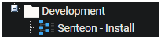
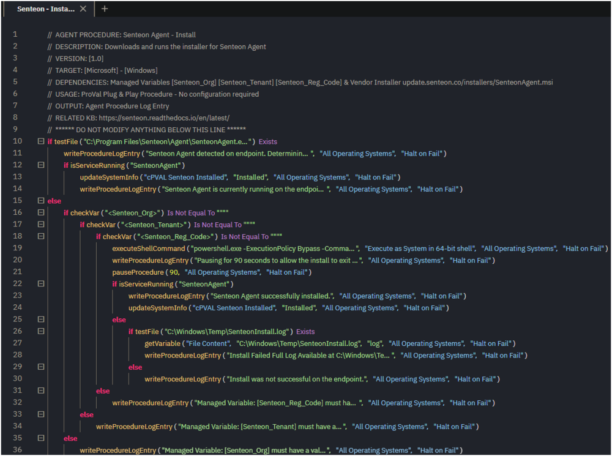
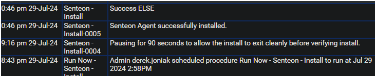
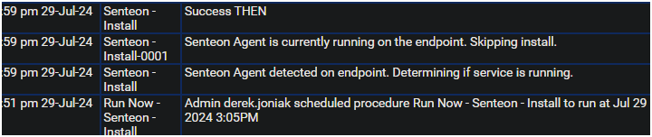

## Summary

This document describes how to download and run the installer for the Senteon Agent on the endpoint. It also details how to update the custom field if the installation is successful.

## Dependencies

| Content | Type | Function |
|---------|------|----------|
| [cPVAL Senteon Installed](/docs/bc1c7f2d-8eb4-41a3-bb12-8150cdeb0241) | Custom Field | This custom field is used to determine if the Senteon Agent is installed on the endpoint. |
| [Senteon_Org](/docs/547c90df-abff-46a8-9e02-aec45b265672) | Managed Variable | This managed variable is used to store the Senteon ID/Name of the partner's organization. |
| [Senteon_Tenant](/docs/58ce658a-6821-4420-9685-5ed8c963c2b1) | Managed Variable | This managed variable is used to store the Senteon ID/Name of the tenant the partner wishes to register the agent/endpoint to. |
| [Senteon_Reg_Code](/docs/2c7e719e-7654-47e6-9ff0-d5261ae67eb8) | Managed Variable | This managed variable is used to store the Senteon registration code of the tenant the partner wishes to register the agent/endpoint to. |

## Associated Content

[SWM - Software Management - Solution - Senteon Agent](/docs/5cc5165d-4314-499b-9357-299f3b04f402)

## Implementation

Export the agent procedure from the ProVal VSA and import it into the partner VSA.  
**Name:** Senteon - Install  
  
  

**ProVal Plug & Play:** No agent procedure configuration is required. Ensure dependencies exist prior to usage.

## Output

### Agent Procedure Log Entry

**Successful Install**  
  

**Existing Install**  
  

