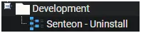
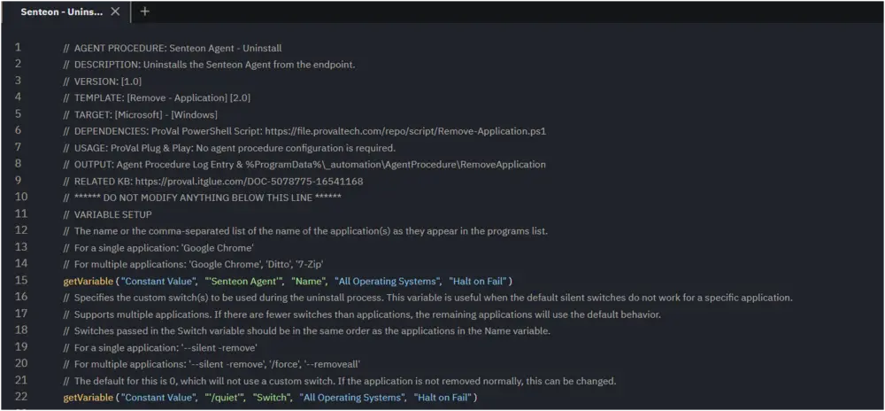
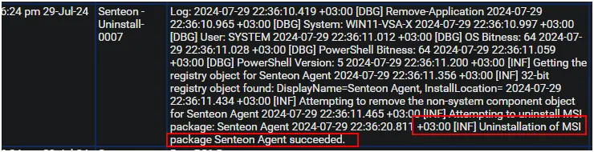

## Summary

This document outlines the steps to uninstall the Senteon Agent from the endpoint.  
This agent procedure utilizes the [Remove - Application](/docs/5197b52f-294e-4b7d-8956-5bc5afc3f51c) agent procedure template to perform the uninstall.

## Associated Content

[SWM - Software Management - Solution - Senteon Agent](/docs/5cc5165d-4314-499b-9357-299f3b04f402)

## Implementation

Export the agent procedure from the ProVal VSA and import it into the partner VSA.  
**Name:** Senteon - Uninstall  
  
  

Proval Plug & Play Procedure: The agent procedure requires no configuration.

## Output

Agent Procedure Log Entry  
**Success**  
  