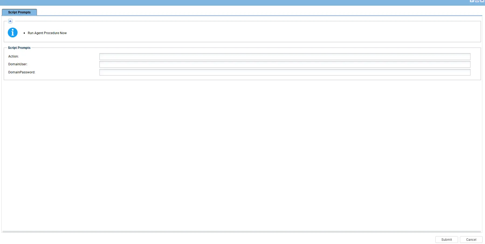
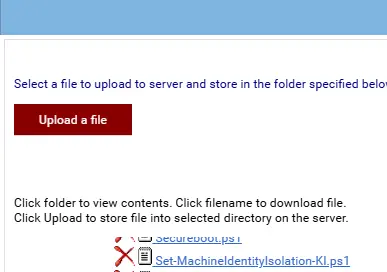

## Summary

Use this script to identify and remediate domain trust failures caused by Machine Identity Isolation (MII) enforcement after the September 2026 Windows 11 updates. It never restarts the device.

Affected devices can show: `The trust relationship between this workstation and the primary domain failed`.

## Sample Run

## Dependencies

- [Set - MachineIdentityIsolation](/docs/6e3a2154-42ba-471c-8cd5-379e95b3732f)

## Parameters

| Parameter | Required | Default | Type | Description |
| --- | --- | --- | --- | --- |
| `Action` | No | `Status` | String | Choose `Status`, `Disable`, or `Repair`. |
| `domainUser` | For `Repair` |  | PSCredential | Domain User name used to reset the computer account secure channel. |
| `domainPassword` | For `Repair` |  | PSCredential | Domain password used to reset the computer account secure channel. |

## Implementation

1. Export the agent procedure from ProVal's VSA RMM instance.   
   **Name:** `Set - MachineIdentityIsolation`   

   The export will download the necessary XML file.   
   
2. Import this XML file into the partner's VSA RMM instance.   

3. Export the `Set-MachineIdentityIsolation-KI.ps1` from the ProVal's Internal VSA. This is also placed under the below path:  
`Manage Files` > `Shared Files` > `PVAL` > `Set-MachineIdentityIsolation-KI.ps1`  

    

4. Map the `Set-MachineIdentityIsolation-KI.ps1` into the `28th` step of the script in the client's environment.
   
## Output

Agent Procedure Log
C:\ProgramData\_Automation\Script\Set-MachineIdentityIsolation\Set-MachineIdentityIsolation-log.txt

## Changelog

### 2026-09-22

- Initial version of the document