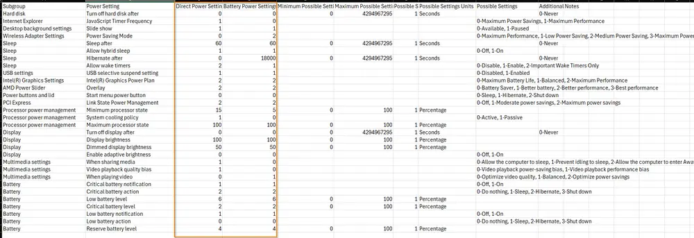

# Overview
This document configures power plan settings using the provided CSV file. If the specified power plan does not exist, it will be created.

# Configuration/VSA Implementation
This procedure requires the following template to be completed:

- PowerPlanSettingsTemplate.csv

This file is located in the attachments as well as the agent procedure.



The values that can be modified are the **Direct Power Settings** and **Battery Power Settings** within this template. The maximum and minimum values are shown for reference along with any other important information.

# Process
- Ensures mandatory parameters are provided and validates the parameter format and structure.
- Retrieves available power plans using `powercfg /list`.
- Checks if the specified power plan (`$Name`) exists.
- If not, duplicates the active plan and renames it to the specified name.
- Retrieves current settings of the power plan.
- If a download URL is provided for `$CSVPath`, downloads and converts the CSV file to a PowerShell object.
- If a local computer path is provided for `$CSVPath`, converts the contents of the CSV file to a PowerShell object.
- If using a hashtable (`$Setting`), creates an array of settings based on the hashtable structure.
- Iterates through each setting in the configuration.
- Retrieves GUIDs for the subgroup and power setting from the current power plan settings.
- Uses `powercfg` commands to set AC and DC values for the specified subgroup and power setting.
- Logs success or error messages for each configuration attempt.

# Payload Usage
Configures a custom power plan named 'CustomPlan' with specified AC and DC power settings.

```
./PS C:/> ./Set-PowerPlanSettings.ps1 -Name 'CustomPlan' -Setting @{Subgroup=@{'Sleep' = @{ PowerSetting = @{ 'Sleep after' = @{ AC = 60; DC = 60 }; 'Allow hybrid sleep' = @{ AC = 1; DC = 100}; 'Hibernate After' = @{ AC = 0; DC = 18000}; 'Allow Wake Timers' = @{ AC = 2; DC = 2 }}}}}
```

Configures a custom power plan named 'CustomPlan' with specified AC and DC power settings from the `$Settings` hashtable.

```
./PS C:/> $setting = @{
            Subgroup = @{
                'Hard Disk' = @{
                    PowerSetting = @{
                        'Turn off hard disk after' = @{
                            AC = 0
                            DC = 0
                        }
                    }
                }
                'Internet Explorer' = @{
                    PowerSetting = @{
                        'JavaScript Timer Frequency' = @{
                            AC = 1
                            DC = 0
                        }
                    }
                }
                'Sleep' = @{
                    PowerSetting = @{
                        'Sleep after' = @{
                            AC = 60
                            DC = 60
                        }
                        'Allow hybrid sleep' = @{
                            AC = 1
                            DC = 100
                        }
                        'Hibernate After' = @{
                            AC = 0
                            DC = 18000
                        }
                        'Allow Wake Timers' = @{
                            AC = 2
                            DC = 2
                        }
                    }
                }
                'Intel(R) Graphics Settings' = @{
                    PowerSetting = @{
                        'Intel(R) Graphics Power Plan' = @{
                            AC = 2
                            DC = 2
                        }
                    }
                }
                'AMD Power Slider' = @{
                    PowerSetting = @{
                        Overlay = @{
                            DC = 2
                            AC = 2
                        }
                    }
                }
            }
        }

./PS C:/> ./Set-PowerPlanSettings.ps1 -Name 'CustomPlan' -Setting $Settings
```

Configures a custom power plan named 'CustomPlan' with specified AC and DC power settings from the 'CustomPlanTemplate.csv' file located in the 'C:/Temp' directory.

```
PS C:/> ./Set-PowerPlanSettings.ps1 -Name 'CustomPlan' -CSVPath 'C:/temp/CustomPlanTemplate.csv'
```

Configures a custom power plan named 'CustomPlan' with specified AC and DC power settings from the 'CustomPlanTemplate.csv' downloaded from 'https://file.provaltech.com//CustomPlanTemplate.csv'.

```
PS C:/> ./Set-PowerPlanSettings.ps1 -Name 'CustomPlan' -CSVPath 'https://file.provaltech.com\\CustomPlanTemplate.csv'
```

# Parameters

| Parameter   | Alias | Required | ParameterSetName | Type   | Description                                                                                       |
|-------------|-------|----------|-------------------|--------|---------------------------------------------------------------------------------------------------|
| `Name`      |       | True     | hashtable, csv     | String | Specifies the name of the power plan to configure.                                               |
| `CSVPath`   |       | True     | hashtable          | String | Specifies the path to a CSV file containing the power plan configuration, which can be either a local file on the computer or a download URL. |
| `Setting`   |       | True     | hashtable          | HashTable | Specifies a hashtable containing the configuration for the power plan.                           |

# Output
```
./Set-PowerPlan-log.txt
./Set-PowerPlan-Error.txt
```
## Attachments
[PowerPlanSettingsTemplate.csv](<../../../static/attachments/itg/14956509/PowerPlanSettingsTemplate.csv>)