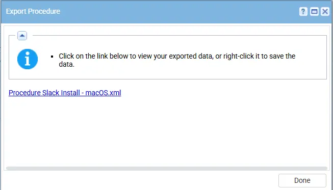
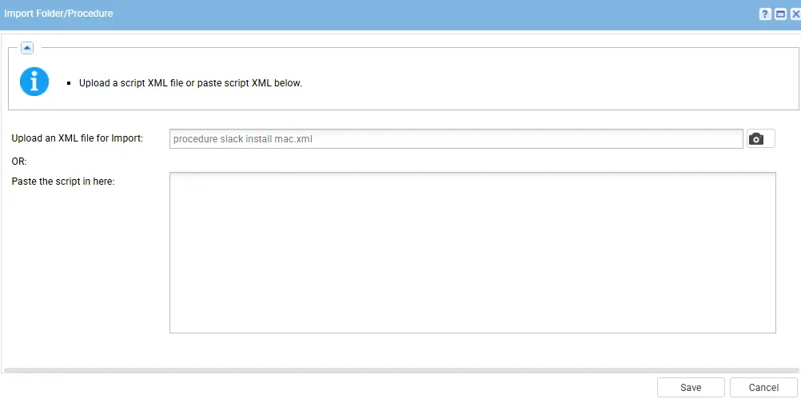
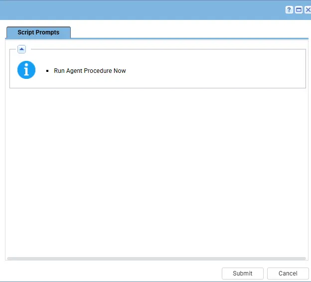

## Summary

This script is used to check the status of the slack application on the mac machine and  if its not available, then it will install it on the mac machine and will validate after the installation.

## Implementation

1. Export the agent procedure from ProVal's VSA RMM instance.  
Name: `Slack Install MAC`
   
The export will download the necessary XML file.

2. Import this XML file into the partner's VSA RMM instance.  

3. To `Execute`, select the agent procedure and click on run now and then submit.

## Output

- Agent Procedure Log

## Changelog

### 2026-05-01

- Initial version of the document