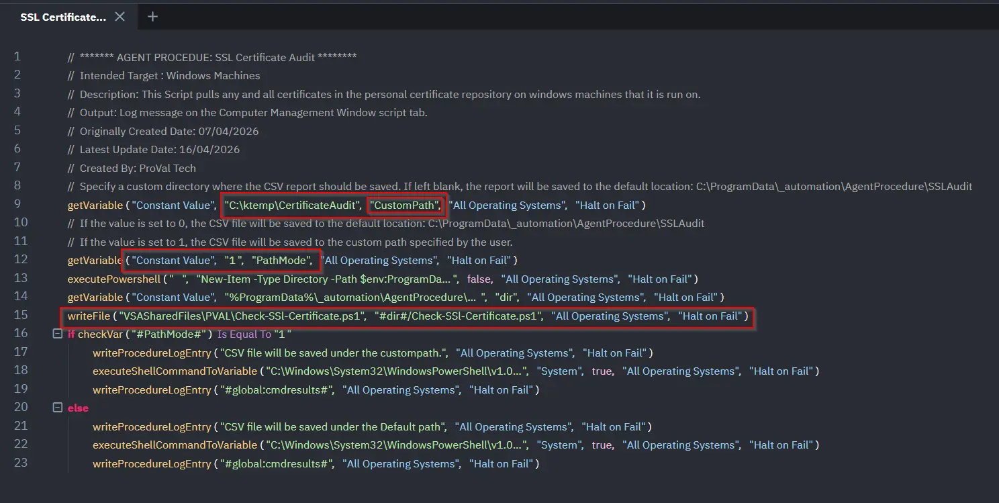

## Summary

This Script pulls any and all certificates in the personal certificate repository on windows machines that it is run on. Then creates a CSV file under the `C:\ProgramData\_automation\AgentProcedure\SSLAudit`

This Script pulls any and all certificates in the personal certificate repository on windows machines that it is run on. We have used below 2 variables under the script.

1. CustomPath : Used to set the custom path where the user wants to save the CSV file contains the Certificate details
2. PathMode 
      - If the `PathMode` value is set to `0`, the CSV file will be saved to the default location: `C:\ProgramData\_automation\AgentProcedure\SSLAudit`.
      - If the `PathMode` value is set to `1`, the CSV file will be saved to the custom path specified by the user.

## Implementation

1. Export the agent procedure from ProVal's VSA RMM instance.   
   **Name:** `SSL Certificate Audit`   
     
   The export will download the necessary XML file.   
   
2. Import this XML file into the partner's VSA RMM instance.   

3. Export the `Check-SSL-Certificate.ps1` from the ProVal's Internal VSA. This is also placed under the below path:  
`Manage Files` > `Shared Files` > `PVAL` > `Check-SSL-Certificate.ps1`  

   

4. Map the `Check-SSL-Certificate.ps1` file to Line 15 within the client’s environment.

   - If a custom path is required for saving the CSV file, specify the path at Line 9 of the script.

      - Also, Set the value at Line 12 as follows:
          - Set to 1 to save the file to the custom path defined at Line 1.
          - Set to 0 to save the file to the default location (C:\ProgramData\_automation\AgentProcedure\SSLAudit).

    

5. Execute the agent procedure in the partne's VSA RMM and click Submit:

   

## Output

- Script log

- `C:\ProgramData\_automation\AgentProcedure\SSLAudit\.csv-file-name`

- `Custompath` Specified by user.

## Changelog

### 2026-04-16

  - Updated the script to use a parameterized output path, allowing the CSV file to be saved to a user-defined location or fallback to the default directory if no custom path is provided.

   - Implemented logic to validate the input path and automatically use the default location `(C:\ProgramData\_automation\AgentProcedure\SSLAudit)` when the parameter is null or empty.

### 2026-04-08

- Initial version of the document