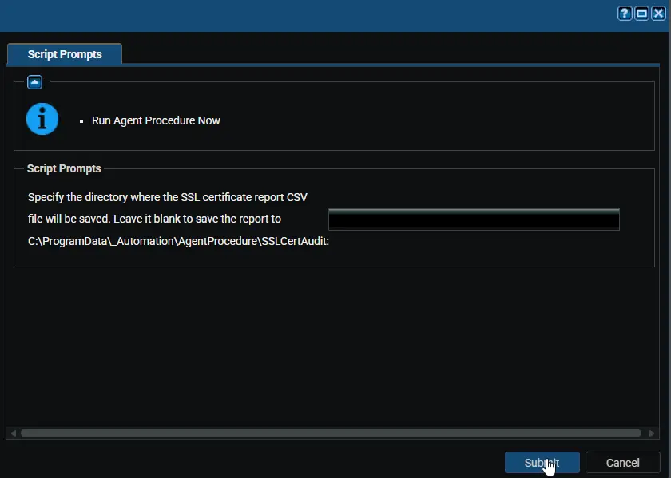
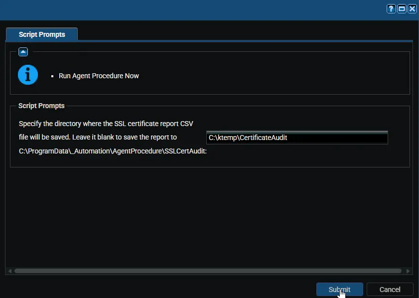

## Summary

This procedure collects all certificates from the Personal certificate store on the Windows device where it runs.

After collecting the certificate details, it creates a CSV report and saves it to a folder on the device.

By default, the CSV file is saved in:

`C:\ProgramData\_Automation\AgentProcedure\SSLCertAudit`

You can also choose a different folder by using the `CSVPath` parameter in VSA.

The report includes useful certificate details such as:

- Friendly Name
- Subject
- Issuer
- Thumbprint
- Archived status
- Private key status
- Serial number
- Version
- Certificate start date
- Certificate expiration date
- Collection date and time

The CSV file name is created automatically and includes a timestamp so each run creates a separate report.

Example file name:

`SSLCertReport_20260424_103000.csv`

## Sample Run

### Example 1: Saving the report to the default path `C:\ProgramData\_Automation\AgentProcedure\SSLCertAudit`

### Example 2: Saving the report to a custom path: `C:\ktemp\CertificateAudit`

## Managed Files

- `Manage Files` -> `Shared Files` -> `PVAL` -> `Get-SSLCerts.ps1`

## User Parameters

| Name | Example | Mandatory | Description |
| ---- | ------- | --------- | ----------- |
| CSVPath | `C:\Reports\Certificates` | No | Optional. Use this to choose a custom folder for the CSV report. If this is left blank or an invalid path is entered, the procedure uses the default folder: `C:\ProgramData\_Automation\AgentProcedure\SSLCertAudit` |

## Output

- Procedure log
- CSV report saved to the default location: `C:\ProgramData\_Automation\AgentProcedure\SSLCertAudit`
- If `CSVPath` is provided and valid, the CSV report is saved to that custom location instead

## Changelog

### 2026-04-24

- Updated the script to use a parameterized output path, allowing the CSV file to be saved to a user-defined location or fallback to the default directory if no custom path is provided.
- Implemented logic to validate the input path and automatically use the default location `(C:\ProgramData\_automation\AgentProcedure\SSLAudit)` when the parameter is null or empty.
- Code-signed the PowerShell script

### 2026-04-08

- Initial version of the document
