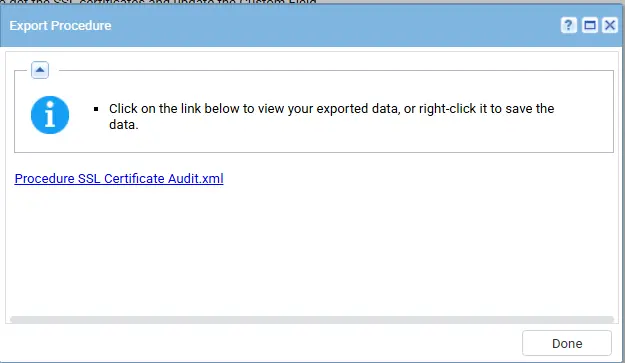
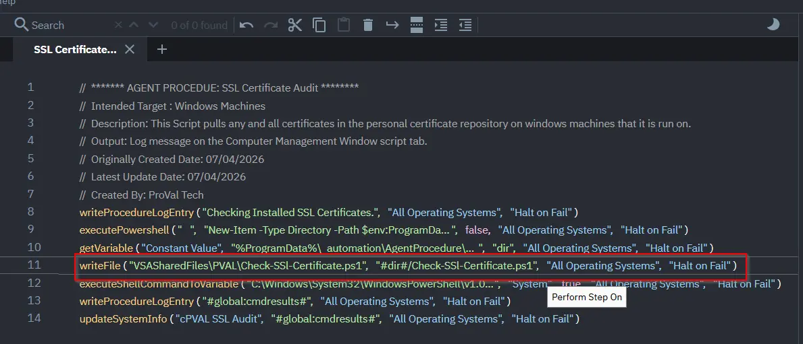

## Summary

This Script pulls any and all certificates in the personal certificate repository on windows machines that it is run on. Then creates a CSV file under the `C:\ProgramData\_automation\AgentProcedure\SSLAudit`

## Implementation

1. Export the agent procedure from ProVal's VSA RMM instance.   
   **Name:** `SSL Certificate Audit`   
     
   The export will download the necessary XML file.   
   
2. Import this XML file into the partner's VSA RMM instance.   

3. Export the `Check-SSL-Certificate.ps1` from the ProVal's Internal VSA. This is also placed under the below path:  
`Manage Files` > `Shared Files` > `PVAL` > `Check-SSL-Certificate.ps1`  

   

4. Map the `Check-SSL-Certificate.ps1` into the 11th step of the script in the client's environment.

    

5. Execute the agent procedure in the partne's VSA RMM and click Submit:
   

## Output

Script log
`C:\ProgramData\_automation\AgentProcedure\SSLAudit\.csv-file-name`

## Changelog

### 2026-04-08

- Initial version of the document