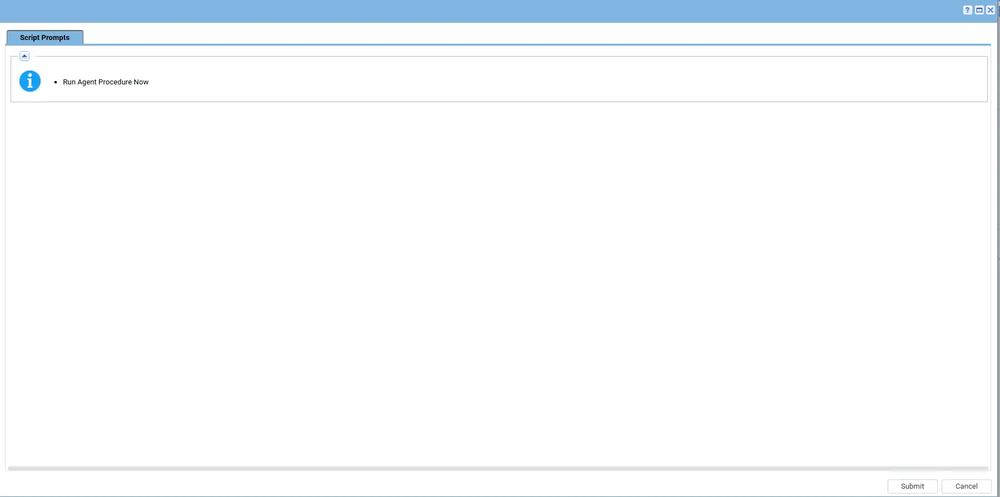

## Summary

This Script pulls any and all certificates in the personal certificate repository on windows machines that it is run on. Then Creates a CSV file under the `C:\ProgramData\_automation\AgentProcedure\SSLAudit`

## Sample Run

## Requirement

Upload the powershell file rom the location `VSASharedFiles\Client Specific Powershell\Groff\Check-SSl-Certificate.ps1` into the client environment's managed files.

Map the ps1 file under the line number 11.

## Output

Script log
`C:\ProgramData\_automation\AgentProcedure\SSLAudit\.csv-file-name`

## Changelog

### 2026-04-08

- Initial version of the document