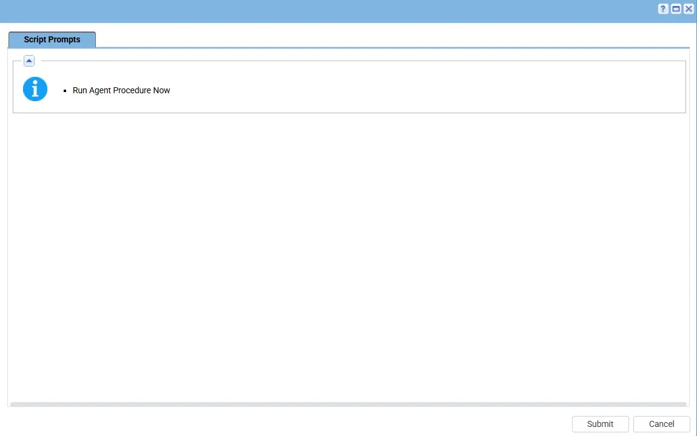
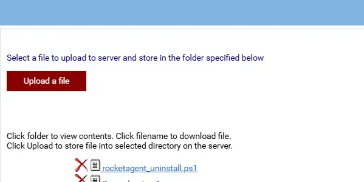

## Summary

This script performs a complete removal of the RocketCyber Agent from Windows systems. It stops agent services, deletes uninstall records, and removes all RocketAgent files and directories.

## Sample Run

## Implementation

1. Export the agent procedure from ProVal's VSA RMM instance.   
   **Name:** `Uninstall - RocketCyber Agent`   

   The export will download the necessary XML file.   
   
2. Import this XML file into the partner's VSA RMM instance.   

3. Export the < Name of the ps1 file > from the ProVal's Internal VSA. This is also placed under the below path:  
`Manage Files` > `Shared Files` > `PVAL` > `rocketagent_uninstall.ps1`  

   

4. Map the `rocketagent_uninstall.ps1` into the `12th` step of the script in the client's environment.   

## Output

- Script Logs

## Changelog

### 2026-06-11

- Initial version of the document

