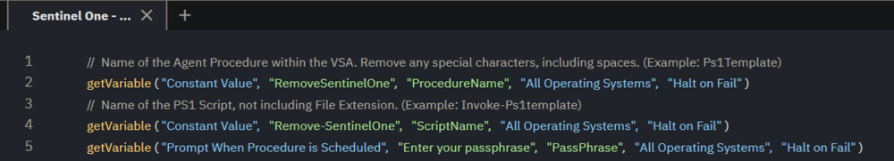

# Overview
This script is designed to uninstall the SentinelOne agent from a Windows system. If Anti-Tamper is enabled, a passphrase must be provided.

# Requirements
- PowerShell v5 or higher
- Administrative privileges are required for execution

# Process
1. The script starts by setting up the necessary parameters, including the optional passphrase.
2. It detects the currently installed version of the SentinelOne agent on the system.
3. The script proceeds to attempt the uninstallation of the SentinelOne agent.
4. If Anti-Tamper is enabled and a passphrase is required, it uses the provided passphrase.
5. The script completes the uninstallation process, ensuring all necessary steps are taken to remove the agent securely.

# VSA Implementation
In the VSA, there are two procedures for this script.

**SentinelOne - Uninstall** - This procedure requires the endpoint(s) to have Anti-Tamper disabled but can be used on multiple endpoints or on a scheduled basis if necessary. No configuration is required.

**SentinelOne - Uninstall (Anti-Tamper)** - This procedure can only be run on one endpoint and requires the passphrase of the endpoint.

The agent procedure is set to prompt for the passphrase when the procedure is scheduled.



The client can find the passphrase for the endpoint in the SentinelOne portal.


# Payload Usage
Run the script without a passphrase:
```
./Remove-SentinelOne.ps1
```

Run the script with a passphrase:
```
./Remove-SentinelOne.ps1 -PassPhrase 'your_passphrase'
```

# Parameters

| Parameter      | Alias | Required | Default | Type   | Description                                  |
|----------------|-------|----------|---------|--------|----------------------------------------------|
| `-PassPhrase`  |       | False    |         | String | Passphrase for disabling anti-tampering     |

# Output
Location of output for log, result, and error files.
```
./Remove-SentinelOne-log.txt
./Remove-SentinelOne-error.txt
```

