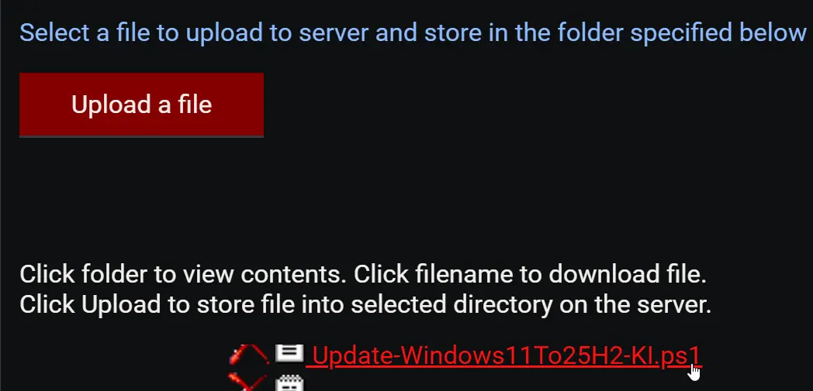
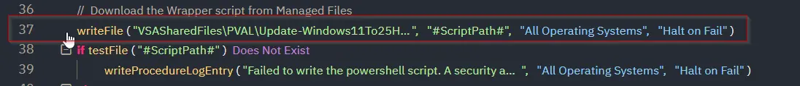
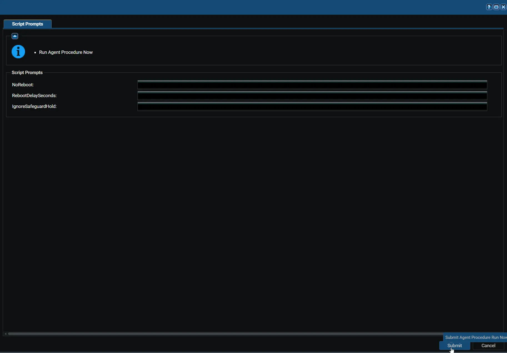

## Summary

Upgrades Windows 11 version 24H2 devices to version 25H2 with a single restart. Apps, files, and settings stay in place.

The upgrade uses Microsoft's enablement package (KB5054156), a small update that switches on 25H2 features already delivered to the device by monthly updates. To learn how it works, see [KB5054156: Feature update to Windows 11, version 25H2 by using an enablement package](https://support.microsoft.com/en-us/topic/kb5054156-feature-update-to-windows-11-version-25h2-by-using-an-enablement-package-4d307e2d-3028-4323-bb46-552cff491643).

It works by running the [Update-Windows11To25H2](/docs/aa9612e1-f474-47b8-b71f-7d0e803beb36) script. Devices that do not qualify are left unchanged and reported as failures.

:::warning  
`NoReboot` does not guarantee that the device stays up. It only stops this agent procedure from restarting the device. Windows Update can still restart it on its own schedule, for example to finish installing other updates, and patch policies or users can restart it too. Any restart completes the upgrade, so run this agent procedure inside a maintenance window if restart timing matters.  
:::

:::note  
Devices need Windows 11 version 24H2 with the August 29, 2025 update (KB5064081) or any later monthly update.  
:::

## Dependencies

- [PowerShell: Update-Windows11To25H2](/docs/aa9612e1-f474-47b8-b71f-7d0e803beb36)

## Implementation

1. Export the agent procedure from ProVal's VSA RMM instance.  
   **Name:** `Update Windows 11 24H2 To 25H2 [Enablement Package]`  

   The export will download the necessary XML file.  
2. Import this XML file into the partner's VSA RMM instance.  
3. Export the `Update-Windows11To25H2-KI.ps1` from ProVal's Internal VSA. This is also placed under the below path:  
`Manage Files` > `Shared Files` > `PVAL` > `Update-Windows11To25H2-KI.ps1`  
    
4. Map the `Update-Windows11To25H2-KI.ps1` into the procedure's writeFile step (Step 37) in the client's environment.  
    

## Sample Run

## Variables

| Variable | Type | Default | Description |
|----------|------|---------|-------------|
| `NoReboot` | String | `False` | Installs the upgrade without restarting the device. The upgrade completes on the next restart from any source. See the warning in the Summary. `Accepted values: 1, Yes, True` |
| `RebootDelaySeconds` | String | `300` | Seconds to wait before restarting, from 60 to 86400. Signed-in users see a restart warning during this time. Any other value stops the script before it makes changes. Ignored when `NoReboot` is set. |
| `IgnoreSafeguardHold` | String | `False` | Installs the upgrade even when Microsoft has placed a safeguard hold on the device. Use only on tested devices. `Accepted values: 1, Yes, True` |

:::note  
The procedure saves only the variables you set to a configuration file on the device. If the file is missing or empty, the script runs with the defaults and restarts the device after 5 minutes. If the file cannot be read, the script stops without making changes.  
:::

## Results by Device

| Device | Result |
|--------|--------|
| Windows 11 24H2, all requirements met | Upgraded to 25H2. Restarts after the delay unless `NoReboot` is set. |
| Windows 11 25H2 or newer | Success. No changes. |
| Windows 11 24H2 without the required update | Failure. No changes. Install the latest monthly update and run again. |
| Windows 11 23H2 or earlier, or Windows 10 | Failure. No changes. These versions need a full feature update instead. |
| Windows 11 LTSC edition or Windows Server | Failure. No changes. Not eligible for this upgrade. |
| Device under a safeguard hold | Failure. No changes, unless `IgnoreSafeguardHold` is set. |

:::note  
A safeguard hold is Microsoft blocking an update on devices with a known problem, such as an incompatible driver. The failure message includes the safeguard ID, which you can look up on the [Windows 11, version 25H2 known issues](https://learn.microsoft.com/en-us/windows/release-health/status-windows-11-25h2) page.  
:::

## Output

- Agent Procedure Log
- Script logs on the device:
  - `C:\ProgramData\_Automation\Script\Update-Windows11To25H2\Update-Windows11To25H2-log.txt`
  - `C:\ProgramData\_Automation\Script\Update-Windows11To25H2\Update-Windows11To25H2-error.txt`

## Changelog

### 2026-10-06

- Initial version of the document.
