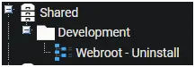
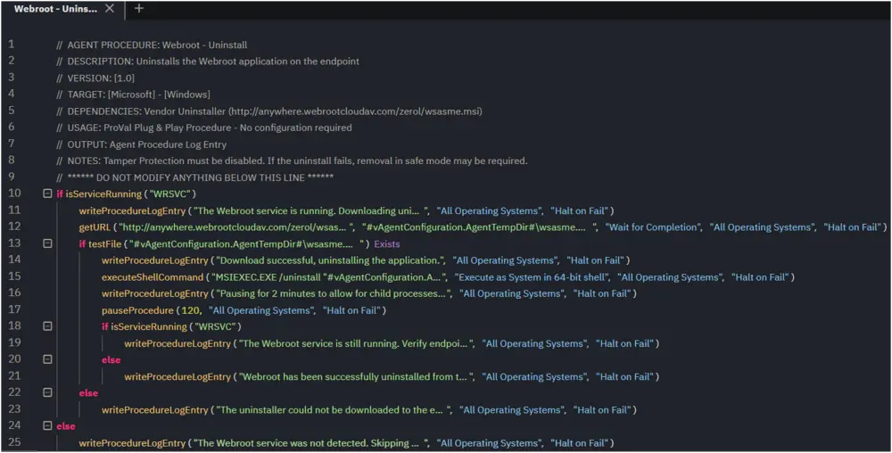
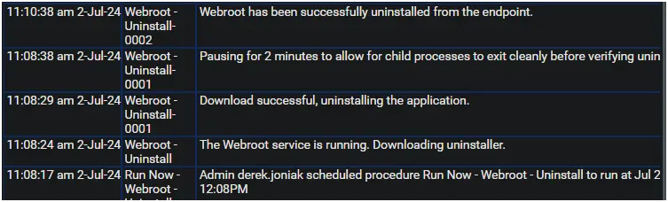
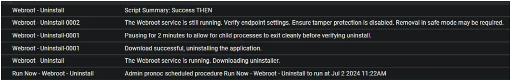

## Summary

This document describes the process for uninstalling the Webroot application on the endpoint.

## Implementation

1. Export the agent procedure from the ProVal VSA and import it into the partner VSA.  
   **Name:** Webroot - Uninstall  
     

     

2. Proval Plug & Play Procedure: The agent procedure requires no configuration.

     
   **Note:** Tamper Protection must be disabled. If the uninstall fails, removal in safe mode may be required.

## Dependencies

- Vendor Uninstaller ([Download](http://anywhere.webrootcloudav.com/zerol/wsasme.msi))

## Output

### Agent Procedure Log Entry

- **Success**  
    

- **Failure**  
    
