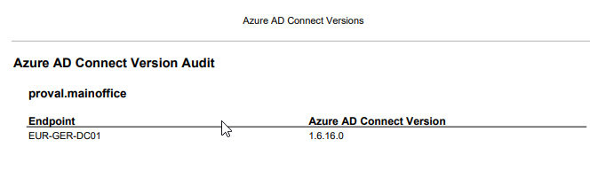

# Summary
Reports on all endpoints where the xPVAL Azure AD Connect Version Custom field is populated with a valid software version.

## Dependencies
List any related content listed in the Related Items section at the right side of ITGlue. Include Report Parts, Views, Custom Fields, and Solutions, if applicable.

- [SWM - Software Configuration - Policy - Azure AD Connect Version Audit](https://proval.itglue.com/DOC-5078775-9853853)
- [SWM - Software Configuration - Report Part - Azure AD Connect Version Audit](https://proval.itglue.com/DOC-5078775-9853854)
- [SWM - Software Configuration - View - xPVAL Azure AD Connect Version](https://proval.itglue.com/DOC-5078775-9853845)
- [SWM - Software Configuration - Custom Field - xPVAL Azure AD Connect Version](https://proval.itglue.com/DOC-5078775-9853852)
- [SWM - Software Configuration - Agent Procedure - Azure AD Connect Version Audit](https://proval.itglue.com/DOC-5078775-9853848)
- [SWM - Software Configuration - Report - Azure AD Connect Version Audit](https://proval.itglue.com/5078775/docs/9853843)

## Report Type
Modern Report

### Layout
List the report parts used. If custom report parts were designed during report creation, list their properties and attributes.

- Report Parts used
  - [SWM - Software Configuration - Report Part - Azure AD Connect Version Audit](https://proval.itglue.com/DOC-5078775-9853854)

### General
- Report Format: PDF
- Paper Size: Letter
- Paper Orientation: Portrait
- Custom Email Settings: None

### Cover Page, Header, Footer
Defaults

### Sample Report

### Export Attachment
Attach the export XML of the report to this document.

