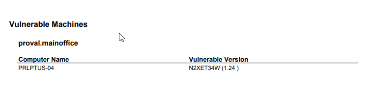

# Summary
This VSA report checks Audit data BIOS Version against a known list of vulnerable BIOS Versions  
[https://support.lenovo.com/us/en/product_security/LEN-73440](https://support.lenovo.com/us/en/product_security/LEN-73440)

# Report Type
Report (Modern)

### Layout
List the report parts used. If custom report parts were designed during report creation, list their properties and attributes

- Report Parts used
  - Vulnerable BIOS Updates
- Vulnerable BIOS Updates
  - Audit-Machine Summary
  - Grid
  - Columns: Bios Version, Computer Name
  - Ordering and Grouping
    - Group By Columns: Group Name
  - Filtering
    - Advanced Filters (Field, Operator, Value)
      - BIOS Version Like \<SEE BELOW FOR LIST>*
        - E8CN33WW
        - HBCN21WW
        - GLCN43WW
        - DZCN42WW
        - DVCN23WW
        - EMCN52WW
        - GFCN23WW
        - BGCN35WW
        - ATCN46WW
        - HHCN25WW
        - GKCN51WW
        - H1CN46WW
        - G9CN28WW
        - GKCN52WW
        - HACN35WW
        - BHCN44WW
        - BUCN31WW
        - AYCN26WW
        - AWCN28WW
        - DKCN54WW
        - CXCN34WW
        - HECN24WW
        - G7CN21WW
        - E7CN44WW
        - EGCN36WW
        - FCCN17WW

### General
- Report Format: PDF
- Paper Size: Letter
- Paper Orientation: Portrait
- Custom Email Settings: none

### Cover Page, Header, Footer
No Header, Footer, or Coverpage should be configured on this report.

### Sample Report

