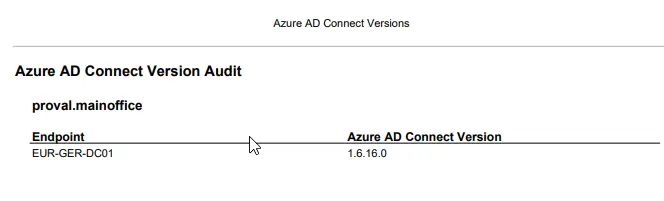

# Summary
This report details all endpoints where the xPVAL Azure AD Connect Version Custom field is populated with a valid software version.

## Dependencies
List any related content found in the Related Items section on the right side of ITGlue. Include Report Parts, Views, Custom Fields, and Solutions, if applicable.

- [SWM - Software Configuration - Policy - Azure AD Connect Version Audit](/docs/c4e6e974-94df-4a7f-940e-6ba95d49d4cd)
- [SWM - Software Configuration - Report Part - Azure AD Connect Version Audit](/docs/04af5f51-5656-4086-b2d2-94cb62388831)
- [SWM - Software Configuration - View - xPVAL Azure AD Connect Version](/docs/c5607e81-8d80-4096-a9d8-76b39ba71db3)
- [SWM - Software Configuration - Custom Field - xPVAL Azure AD Connect Version](/docs/cce3e0b2-3fe2-43d2-ba22-ca7885d4729a)
- [SWM - Software Configuration - Agent Procedure - Azure AD Connect Version Audit](/docs/ee5f96bd-884f-4b2e-af03-9aece0e37d67)
- [SWM - Software Configuration - Report - Azure AD Connect Version Audit](/docs/04af5f51-5656-4086-b2d2-94cb62388831)

## Report Type
Modern Report

### Layout
List the report parts used. If custom report parts were designed during report creation, list their properties and attributes.

- Report Parts used:
  - [SWM - Software Configuration - Report Part - Azure AD Connect Version Audit](/docs/04af5f51-5656-4086-b2d2-94cb62388831)

### General
- Report Format: PDF
- Paper Size: Letter
- Paper Orientation: Portrait
- Custom Email Settings: None

### Cover Page, Header, Footer
Defaults

### Sample Report

### Export Attachment
Attach the export XML of the report to this document.