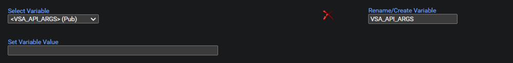
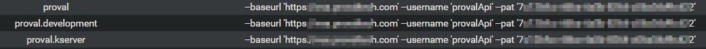

<div class='text-section scrollable'>
VSA_API_ARGS are the necessary parameters required for using VSAToolbox, a set of tools to interact with a Kaseya VSA server's API.
</div>

## Dependencies

<div class='text-section scrollable'>
What VSA content relies on this Managed Variable?  
[VSAToolbox](https://proval.itglue.com/5078775/docs/15281068)
</div>

## Example Data

<div class='text-section scrollable'>
### 

  

Please note the arguments have changed in VSAToolbox from previously used procedures. Ensure the arguments have been updated to match those seen below. Verify there are two hyphen's -- before each argument.

```
--baseurl 'https://subdomain.server.com' --username 'EXAMPLEUSER' --pat '00000000-0000-0000-0000-000000000000'
```

`--baseurl 'https://subdomain.server.com'`  
The base URL that the VSA API can be accessed from. should be in the format 'https://subdomain.server.com'

`--username 'EXAMPLEUSER'`  
The username to use for VSA API authentication.

`--pat '00000000-0000-0000-0000-000000000000'`  
The personal access token to use for VSA REST API authentication.
</div>


