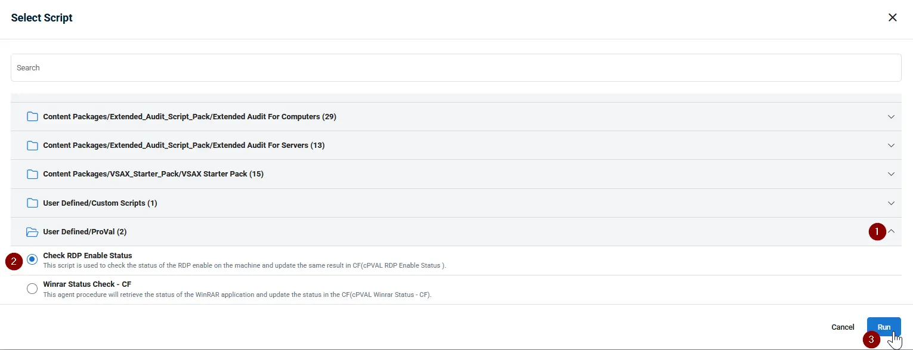
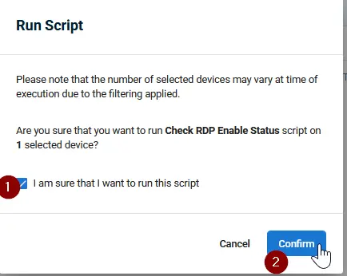
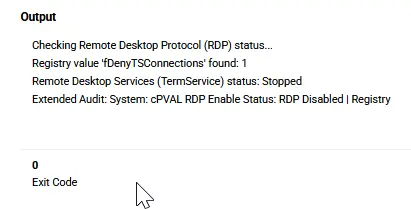

## Summary

This script is used to check the status of the RDP enable on the machine and update the same result in CF([cPVAL RDP Enable Status](/docs/5e29ac29-98ff-4ba7-8c07-db2747a8e8d8)).

## Sample Run

Navigate to `Actions` > `Run Script`

**Script Path:** `User Defined/ProVal/Check RDP Enable Status`

**I am sure that I want to run this script:**

## Dependencies

[cPVAL RDP Enable Status](/docs/5e29ac29-98ff-4ba7-8c07-db2747a8e8d8)

## Outputs

| Name | Variable Type | Default Value | Custom Field |
| ---- | ------------- | ------------- | ------------ |
| OutputRDPEnableStatus | Text | Nul | [cPVAL RDP Enable Status](/docs/5e29ac29-98ff-4ba7-8c07-db2747a8e8d8) |

## Script Creation

[Script Creation](https://github.com/ProVal-Tech/vsax/blob/main/scripts/check-rdp-enable-status.toml)

## Output

- Script logs  

- Custom Fields
